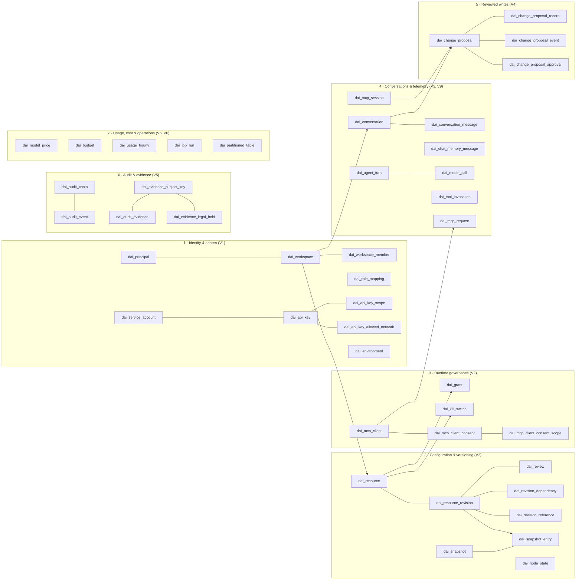
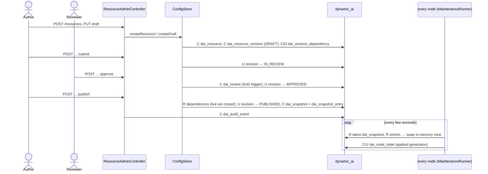

# Schema use-case map — `dynamic_ai`

**What each table is for, who writes and reads it, which business flows run through it, and which features and
requirements it serves.** Structure (columns, keys, indexes, partitions, value sets) is owned by
[LLD-15](../lld/15-database-schema.md) and is not repeated here; this document owns the *behavioural* mapping.

| | |
|---|---|
| Evidence | `scripts/schema-usecase-map/schema_evidence.py` at commit `3363f9b` (2026-10-01): 45 tables, 2 views, 670 access sites, 122 entry points; every row below re-checked by reading the code |
| Produced by | the [`schema-usecase-mapper`](../../.claude/agents/schema-usecase-mapper.md) agent method (§9 to regenerate) |
| Sources | migrations V1–V10, the stores in `persistence`, their callers, [feature catalog](../01-feature-catalog.md), LLDs, ADRs, [open questions](../open-questions.md) |

**How to read citations.** `persistence/…`, `autoconfigure/…`, `ai/…`, `webmvc/…`, `mcp/…`, `security/…` stand for
`spring-ai-mcp-server-common-<module>/src/main/java/com/springaimcpservercommon/<module>/…`; `V3:69` stands for
line 69 of `spring-ai-mcp-server-common-persistence/src/main/resources/db/dynamic-ai/migration/V3__*.sql`.
Operations are **C**reate, **R**ead, **U**pdate, **D**elete. Status: ✅ implemented and reachable ·
◐ partly (some paths unwired) · ○ schema only (no reachable code).

---

## 1. Domain overview

The 45 tables fall into seven groups. Arrows are the main foreign keys (full ER diagrams: LLD-15 §5).



Principles that shape every table (and that a reader should keep in mind):

- **Host data is never stored here.** The schema keeps configuration, decisions and traces; host records stay in
  the host's tables. Even proposals keep only a masked before/after view (ADR-0009, LLD-15 §9.5).
- **Configuration is versioned and immutable once reviewed.** Resources change only through new revisions;
  a publish creates a new cluster-wide *generation* (append-only snapshot) that every node loads (ADR-0006).
- **Telemetry and audit are append-only and partitioned monthly**, so retention is a partition drop
  (LLD-15 §10: telemetry 13 months, audit 14 months, configurable).
- **Personal data is minimised.** Conversation keys and chat-memory keys are hashes; message text is redacted
  before it is stored (F-76); subjects are referenced by opaque principal ids, never e-mail addresses.

## 2. Actors and entry points

| Actor | Enters through | Main tables touched |
|---|---|---|
| End user (chat) | `POST /dynamic-ai/api/agents/{slug}/chat[/stream]` — `webmvc/endpoint/AgentChatController.java:250`, `:325` | principal, grant, kill_switch, budget, conversation(_message), chat_memory, agent_turn, model_call, tool_invocation, usage_hourly, change_proposal*, audit_event |
| End user (own data) | `/dynamic-ai/api/conversations…`, `/dynamic-ai/api/proposals…` — `autoconfigure/ConversationController.java`, `autoconfigure/ProposalReviewController.java` | conversation(_message), chat_memory, change_proposal* |
| API consumer | dynamic endpoints — `webmvc/endpoint/GenericDynamicHandler.java:213`; API key filter `security/apikey/ApiKeyAuthenticationFilter.java:79` | api_key*, service_account, grant, resource/snapshot (endpoint specs) |
| MCP client (IDE, agent) | `POST /dynamic-ai/mcp` — `mcp/server/McpEndpointController.java:120` | mcp_client, mcp_client_consent(_scope), grant, mcp_request, tool_invocation, change_proposal* |
| Admin / author / reviewer | `/dynamic-ai/admin/api/v1/**` (resources, workspaces, role mappings, grants, kill switches, budgets, prices, service accounts, MCP clients) | configuration, IAM and governance tables; every change → audit_event |
| Operator / auditor | trace, audit, usage, cluster APIs — `autoconfigure/TraceAdminController.java`, `AuditAdminController.java`, `UsageAdminController.java`, `ClusterAdminController.java` | telemetry, audit, usage, node_state |
| Each node (scheduler) | `autoconfigure/MaintenanceRunner.java:120` (cron), `:148` poll snapshots, `:153` heartbeat, `:162` sweep; `autoconfigure/ConversationRetentionJob.java` | snapshot(_entry), node_state, resource_revision, change_proposal, partitioned_table, job_run, conversation(_message) |
| Startup | `DaiPersistenceUnit.start` via `autoconfigure/DaiPersistenceAutoConfiguration.java:135` | environment (and Flyway history) |
| Spring AI (framework callbacks) | `ChatMemoryRepository`, `ToolCallback`, advisors — `autoconfigure/StoreChatMemoryRepository.java:48`, `ai/tool/SecuredToolCallback.java:176`, `ai/advisor/InvocationGuardAdvisor.java:186`, `ai/advisor/UsageMeteringAdvisor.java:91` | chat_memory, tool_invocation, change_proposal, budget, usage_hourly |

## 3. Table catalog

Each entry: purpose · use cases · written by · read by · lifecycle · retention/sensitivity · features &
requirements · status. "Written/read by" names the store method and the entry points that reach it.

### 3.1 Identity & access (V1)

#### `dai_environment` — which deployment this database belongs to ✅
- **Purpose**: one row that pins the store to an environment id and tier (DEV/TEST/STAGING/PROD), so a staging
  app can never run against a production store by mistake.
- **Use cases**: refuse to start against a store of another environment; stamp audit events with the tier.
- **Written / read by**: `DaiPersistenceUnit#verifyEnvironment` (inserts on first start, `persistence/unit/DaiPersistenceUnit.java:195`) and `#readEnvironment` (`:217`), at startup only (`autoconfigure/DaiPersistenceAutoConfiguration.java:135`). Native SQL, no entity (`V1:132`).
- **Features / requirements**: F-01, F-75 (environment promotion), LLD-12 (host safety: UNKNOWN tier = PROD), ADR-0019, LLD-15.

#### `dai_principal` — every subject the library has seen ✅
- **Purpose**: stable internal id for a human user, group, service account or MCP client, keyed by
  (issuer, subject type, external id) from the host's identity provider. All other tables refer to it.
- **Use cases**: first sight of a user creates the row (upsert, `last_seen_at` throttled); disable/enable a
  principal; look one up for display in audit and admin screens.
- **Written by**: `PrincipalDirectory#resolveSubject` (upsert SQL built in the constructor, `persistence/identity/PrincipalDirectory.java:63`, `:108`) on every authenticated request through `autoconfigure/StoreSecurityPorts.java:87`; `ServiceAccount#create` for service accounts; `PrincipalDirectory#changeStatus` (`:201`).
- **Read by**: `PrincipalDirectory#find/#findBySubject` (`:153`, `:167`); FK target of 27 tables.
- **Retention / sensitivity**: kept while referenced; holds an external id and optional display name (personal data, INTERNAL). Never an e-mail address.
- **Features / requirements**: F-60 (use the existing IdP), F-65, SEC-01, ADR-0005.

#### `dai_workspace`, `dai_workspace_member` — teams that own resources ✅
- **Purpose**: a workspace is a team boundary; members hold framework roles (OWNER, AUTHOR, REVIEWER, …) in it.
- **Use cases**: create/rename/archive a workspace; add/remove members; resolve a caller's workspace roles on
  every request (`WorkspaceStore#rolesFor`, `persistence/identity/WorkspaceStore.java:232`, via `autoconfigure/StoreSecurityPorts.java:124`).
- **Written by**: `WorkspaceStore#create/#addMember/#removeMember` (`:65`, `:168`, `:195`) ← `WorkspaceAdminController` (`POST /workspaces`, `PATCH`, `DELETE` = archive, `POST|DELETE …/members`).
- **Read by**: `WorkspaceStore#find/#findBySlug/#listActive/#members`; scoping column of most tables.
- **Features / requirements**: F-62, F-63, SEC-01, LLD-12.

#### `dai_role_mapping` — IdP groups → framework roles ✅
- **Purpose**: maps host identity facts (group claim, LDAP DN, authority) to framework roles, globally or per workspace.
- **Use cases**: admin maps "Entra group X" to REVIEWER in workspace Y; every request evaluates the enabled mappings.
- **Written by**: `RoleMappingStore#create/#delete` and enable/disable/replace ← `RoleMappingAdminController` (`/role-mappings`).
- **Read by**: `RoleMappingStore#query` through the role-mapping source bean (`autoconfigure/DaiPersistenceAutoConfiguration.java:530`).
- **Features / requirements**: F-61, SEC-01, ADR-0005.

#### `dai_service_account`, `dai_api_key`, `dai_api_key_scope`, `dai_api_key_allowed_network` — machine consumers ✅
- **Purpose**: a service account is a non-human principal owned by a workspace; it authenticates with API keys
  (only a hash and a lookup prefix are stored), each limited to scopes and optionally to CIDR networks.
- **Use cases**: create/disable a service account; issue a key (shown once), list and revoke keys; authenticate a
  request by key; refuse calls from outside the allowed networks; warn about keys expiring within 14 days.
- **Written by**: `ApiKeyStore#createServiceAccount/#setServiceAccountEnabled/#createKey/#revoke/#touchLastUsed`
  (`persistence/identity/ApiKeyStore.java:78`, `:100`, `:165`, `:275`, `:291`) ← `ServiceAccountAdminController`
  (`/workspaces/{id}/service-accounts…`); `touchLastUsed` ← `ApiKeyAuthenticationFilter` (`security/apikey/ApiKeyAuthenticationFilter.java:79` → `autoconfigure/StoreSecurityPorts.java:351`).
- **Read by**: `#findActiveByPrefix` (`:198`) and `#networks` (`:304`, native SQL) on authentication; `#countExpiringWithin` (`:232`) ← `MaintenanceRunner` sweep.
- **Retention / sensitivity**: key hash only (RESTRICTED); revoked keys stay for audit.
- **Features / requirements**: F-65, OQ-37, SEC-01, LLD-12.

### 3.2 Configuration & versioning (V2)

#### `dai_resource` — a configurable thing ✅
- **Purpose**: identity and lifecycle of each authored artefact, owned by a workspace; `kind` is ENDPOINT, QUERY,
  AGENT, TOOL_BINDING, ROW_POLICY, POLICY_OVERLAY or MCP_SERVER (`V2:27`).
- **Use cases**: create, list, suspend/resume, deprecate, retire a resource.
- **Written by**: `ConfigStore#createResource` (`persistence/config/ConfigStore.java:126`) and the lifecycle
  methods that run inside `newGeneration` (`:543`) ← `ResourceAdminController` (`POST /resources`, `:suspend`, `:resume`, `:deprecate`, `:retire`).
- **Read by**: `ConfigStore#findResource/#resources/#requireResource`; at run time the published snapshot, not this table, is what nodes serve.
- **Features / requirements**: F-20, F-30, F-40, F-55, F-73 (suspend), LLD-09, ADR-0006.

#### `dai_resource_revision` — immutable versions of a resource ✅
- **Purpose**: each edit is a revision: DRAFT → IN_REVIEW → APPROVED → PUBLISHED → SUPERSEDED, or REJECTED,
  STALE, DEPRECATED, RETIRED (`V2:62`).
  A trigger forbids changing a revision after it left DRAFT (`trg_resource_revision_immutable`); one PUBLISHED per resource.
- **Use cases**: create/edit a draft, submit for review, publish, roll back, list history, show the review inbox, expire stale approvals.
- **Written by**: `ConfigStore#createDraft` (`:150`), `#review` (`:311`), `#publish` (`:426`), `#rollback` (`:512`), `#expireApprovals` (`:365`, ← `MaintenanceRunner` sweep).
- **Read by**: `#findRevision/#revisions/#liveRevision(s)/#reviewInbox` ← `ResourceAdminController` GETs.
- **Features / requirements**: F-64 (four-eyes), F-74/F-75, LLD-09 §2, ADR-0006, ADR-0013.

#### `dai_review` — reviewer decisions ✅
- **Purpose**: one row per reviewer decision on a revision (APPROVED / CHANGES_REQUESTED / REJECTED). A trigger
  enforces segregation of duties: the author cannot review their own revision (`trg_review_sod`).
- **Written by**: `ConfigStore#review` ← `ResourceAdminController` `:approve`, `:reject`, `:request-changes`.  **Read by**: `ConfigStore#reviews`.
- **Features / requirements**: F-64, SEC-01, LLD-09.

#### `dai_revision_dependency` — which resources a draft uses ✅
- **Purpose**: edges "agent A uses query Q / tool T", so a publish can refuse a live set with missing
  dependencies and a retire can refuse to remove something still in use.
- **Written by**: `ConfigStore#replaceDependencies` (`:225`).  **Read by**: `#dependencies`, `#requireLiveSetClosed` (`:586`) on publish/retire/rollback.
- **Features / requirements**: LLD-09 §2, ADR-0006.

#### `dai_revision_reference` — pins to host code elements ○
- **Purpose**: records which host entities/attributes/operations a revision depends on and their signature hash
  at authoring time, so a later host deploy that changes them is detected (catalog drift).
- **Status**: **never written.** `ConfigStore#replaceReferences` (`:204`) has no caller, so `#references` (`:247`)
  and `#pinned` (`:764`) always read an empty table. Tracked as **OQ-63** (§7).
- **Features / requirements**: F-14, LLD-03 §6.

#### `dai_snapshot`, `dai_snapshot_entry` — published generations ✅
- **Purpose**: a generation is the complete live set at one moment (append-only; triggers forbid updates).
  Nodes serve exactly one generation; publish, lifecycle changes and rollback each create a new one.
- **Use cases**: publish/rollback; every node polls for a newer generation and swaps its in-memory view; cluster status shows convergence.
- **Written by**: `ConfigStore#newGeneration` (`:543`) ← publish/rollback/lifecycle endpoints.
- **Read by**: `ConfigStore#latestGeneration/#loadSnapshot` (`:611`, `:624`) ← `MaintenanceRunner#pollSnapshots`
  (`autoconfigure/MaintenanceRunner.java:148`) and the snapshot caches (`autoconfigure/ToolBindingSnapshotCache.java:92`, `autoconfigure/StoreSecurityPorts.java:309`).
- **Features / requirements**: F-74, F-75, ADR-0006, ADR-0021 (stateless nodes recompute from the snapshot), LLD-09 §4.

#### `dai_node_state` — which node runs which generation ✅
- **Purpose**: heartbeat per node with the generation it has applied.
- **Written by**: `ConfigStore#heartbeat` (`:792`) ← `MaintenanceRunner#heartbeat` (`:153`); `#pruneNodes` (`:837`) ← sweep.
- **Read by**: `ConfigStore#clusterStatus` (`:814`) ← `GET /cluster/nodes` (`autoconfigure/ClusterAdminController.java:89`).
- **Features / requirements**: LLD-08 §2, LLD-09 §4, ADR-0021.

### 3.3 Runtime governance (V2)

#### `dai_grant` — who may invoke what ✅
- **Purpose**: default-deny allow-list: principal (user, group, service account) × resource/tool × action, per workspace.
- **Written by**: `GrantStore#create/#revoke` ← `GrantAdminController` (`/workspaces/{id}/grants`).
- **Read by**: `GrantStore#grantsFor` (`persistence/config/GrantStore.java:98`) on every invocation through `autoconfigure/StoreSecurityPorts.java:183` (agents, dynamic endpoints, MCP tools).
- **Features / requirements**: F-63, design rule "default deny", SEC-01, ADR-0005.

#### `dai_kill_switch` — emergency stop ✅
- **Purpose**: disable everything, a workspace, a resource or one tool immediately, with reason and optional expiry.
- **Written by**: `KillSwitchStore#set/#clear` ← `KillSwitchAdminController` (`POST|DELETE /kill-switches`).
- **Read by**: `KillSwitchStore#listActive` through a short-TTL cache on every node (`autoconfigure/StoreSecurityPorts.java:210`); history for operators.
- **Features / requirements**: F-73, LLD-09 §4, LLD-12.

#### `dai_mcp_client`, `dai_mcp_client_consent`, `dai_mcp_client_consent_scope` — MCP client trust ✅
- **Purpose**: an MCP client (IDE, external agent) must be registered and approved per workspace (default deny);
  a user then consents to the scopes the client may use on their behalf.
- **Use cases**: register → approve → (user consent) → call tools; revoke a client; list clients.
- **Written by**: `McpClientStore#register` and approve/revoke ← `McpClientAdminController`; `#grantConsent` (`persistence/identity/McpClientStore.java:169`) ← MCP endpoint via `autoconfigure/StoreSecurityPorts.java:386`.
- **Read by**: `#findApproved` (`:130`) and `#activeConsent` (`:210`) on every MCP request (`StoreSecurityPorts.java:365`, `:373`).
- **Features / requirements**: F-55, OQ-49, ADR-0005, SEC-01.

### 3.4 Conversations & telemetry (V3, V9, V10)

#### `dai_conversation`, `dai_conversation_message` — the user-visible transcript ✅
- **Purpose**: a conversation per (user, agent, conversation key hash); messages are the redacted transcript the
  user (and, under audit hold, an auditor) can read back.
- **Use cases**: chat continues a conversation; user lists, reads, closes and erases their conversations;
  auditor reads a transcript or purges it; retention removes expired ones.
- **Written by**: `TelemetryStore#openConversation/#appendMessage` (`persistence/telemetry/TelemetryStore.java:206`, `:268`) ← `autoconfigure/StoreConversationRecorder.java:63` after each chat turn; `#eraseConversation(KeepingForAudit)` (`:367`, `:388`) ← `DELETE /dynamic-ai/api/conversations/{id}` (`autoconfigure/ConversationController.java:218`); `#purgeConversation` (`:411`) ← `ConversationAuditController.java:215`; retention ← `ConversationRetentionJob`.
- **Read by**: `#conversationsOf/#messages/#conversationsOfWorkspace`.
- **Retention / sensitivity**: `retention_until` (30 days default); `audit_hold_until` (V10) keeps an erased conversation for auditors only. Text redacted before storage (F-76). CONFIDENTIAL.
- **Features / requirements**: F-43, F-44, F-76, OQ-38/OQ-52, OQ-44.

#### `dai_chat_memory_message` — the model's memory window ✅
- **Purpose**: the last N user/assistant/system messages the model sees on the next turn, shared by all nodes
  (V9). Different from the transcript: tool traffic is excluded and the key is a hash.
- **Written / read by**: `ChatMemoryStore#replace/#load/#deleteRows` (`persistence/memory/ChatMemoryStore.java:81`, `:61`, `:111`) ← Spring AI through `autoconfigure/StoreChatMemoryRepository.java:48`, `:61` (framework callback); erased together with the conversation.
- **Features / requirements**: F-44, OQ-45, ADR-0021.

#### `dai_agent_turn`, `dai_model_call` — one agent turn and its model calls ✅ (partitioned)
- **Purpose**: what happened in a turn (agent, principal, outcome, tokens, cost, latency, trace id) and each
  model request within it, for the trace viewer and cost analysis. No prompt text.
- **Written by**: `TelemetryStore#recordTurn/#recordModelCall` (`:67`, `:79`) ← `autoconfigure/StoreTurnRecorder.java:63`, `:73` ← `ai/runtime/DefaultAgentInvoker.java:204` (every chat turn).
- **Read by**: `#turnsOfWorkspace/#findTurn/#turnsOfTrace/#modelCallsOfTurn` ← `TraceAdminController` (`/traces/turns…`, `/traces/model-calls`, `/traces/by-trace-id/{traceId}`).
- **Retention**: monthly partitions, 13 months. View `dai_v_turn_usage` (`V3:265`) summarises a turn for operators (not read by code).
- **Features / requirements**: F-42, F-71, F-72, LLD-06, ADR-0018.

#### `dai_tool_invocation` — each tool call ✅ (partitioned)
- **Purpose**: one row per tool call by an agent or MCP client: tool, revision, principal, read/write, outcome, latency, linked proposal.
- **Written by**: `TelemetryStore#recordToolInvocation` (`:91`) ← `autoconfigure/StoreToolCallRecorder.java:52` ← `ai/tool/SecuredToolCallback.java:176` (Spring AI tool callback).
- **Read by**: `#toolInvocationsOfTurn/#…OfMcpRequest/#…OfWorkspace/#toolStats` ← `TraceAdminController` (`/traces/tool-invocations`, `/traces/tool-stats`, turn tree).
- **Features / requirements**: F-16 (write guard evidence), F-41, F-72, ADR-0008, ADR-0014.

#### `dai_mcp_request` — each MCP JSON-RPC request ✅ (partitioned)
- **Written by**: `TelemetryStore#recordMcpRequest` (`:103`) ← `autoconfigure/StoreMcpRequestRecorder.java:36` ← `mcp/server/McpEndpointController.java:120`.
- **Read by**: `TraceAdminController` (`/traces/mcp-requests…`, by trace id).
- **Features / requirements**: F-55, F-72, OQ-49.

#### `dai_mcp_session` — stateful MCP sessions ○
- **Purpose**: session row for MCP's optional *stateful* transport.
- **Status**: **never opened.** `TelemetryStore#openMcpSession` (`:119`) has no caller: MCP runs STATELESS by
  default (OQ-22, ADR-0021) and stateful mode is not implemented (OQ-49). Proposals keep a nullable FK to it.
- **Features / requirements**: F-55 (stateful option), OQ-22, OQ-49.

### 3.5 Reviewed writes (V4)

#### `dai_change_proposal` — a write waiting for its owner's decision ✅
- **Purpose**: every write requested by an agent tool, MCP tool or write endpoint becomes a proposal; nothing is
  written until the owner confirms (and, if required, a second person approves). Holds target, change kind,
  content hash, state, expiry, outcome and the host revision reference after apply.
- **State machine**: PROPOSED/EDITED → (AWAITING_APPROVAL) → CONFIRMED → APPLYING → APPLIED, or REJECTED /
  EXPIRED / CONFLICT / FAILED. CHECK constraints make the confirmer equal to the owner and require timestamps per state (`V4:56-61`).
- **Written by**: `StoreProposalService#createProposal` (`autoconfigure/StoreProposalService.java:80`) ← `ai/tool/SecuredToolCallback.java:287`; `ChangeProposalStore#transition` (`persistence/proposal/ChangeProposalStore.java:230`) ← `ProposalReviewController` `:confirm` (`:275`), `:decline`, `:approve`, `:reject`, `:apply` (`:323`) → `ProposalApplier#apply` (`autoconfigure/ProposalApplier.java:179`, applies through the host's own write path); `#expireDue` (`:372`) ← partition maintenance; stuck APPLYING → FAILED ← `MaintenanceRunner` (`autoconfigure/DaiPersistenceAutoConfiguration.java:878`).
- **Read by**: `#find/#pendingOf/#approvalInbox` ← `GET /dynamic-ai/api/proposals[/{id}]`.
- **Retention**: `retention_until`; purged by maintenance after the terminal state.
- **Features / requirements**: F-27, F-45, F-52, F-64, design rule "writes", ADR-0009, LLD-11.

#### `dai_change_proposal_record`, `dai_change_proposal_event`, `dai_change_proposal_approval` ✅
- **record**: one row per host record touched (bulk = many), masked before/after values and the base version
  used for optimistic conflict detection (`ProposalApplier#staleReason`, `:260`).
- **event**: append-only state history (who moved it, when, what was edited) — `ChangeProposal#appendEvent` (`persistence/proposal/ChangeProposal.java:477`).
- **approval**: second-person decisions; a trigger forbids the owner approving their own proposal (`V4:143-156`) — `ChangeProposal#approve/#reject` (`:357`, `:378`).
- All three are children of the proposal aggregate (JPA `@OneToMany`) and are written and read with it.
- **Features / requirements**: F-45, F-52, F-64, ADR-0009, LLD-11.

### 3.6 Audit & evidence (V5)

#### `dai_audit_chain`, `dai_audit_event` — tamper-evident audit log ✅
- **Purpose**: every security-relevant fact (admin change, denial, proposal decision, break-glass use, turn
  summary) is an append-only event in a SHA-256 hash chain; `dai_audit_chain` holds each chain's head, locked
  while appending so the chain stays linear across nodes.
- **Written by**: `AuditTrail#append` (`persistence/audit/AuditTrail.java:86`) ← `autoconfigure/AdminAudit.java` from every admin controller, the chat and proposal paths, budget denials (`LedgerBudgetChecker`).
- **Read by**: `#page/#eventsOfWorkspace/#eventsOfActor/#denials/#eventsOfProposal/#eventsOfTurn` and `#verify` (`:148`) ← `AuditAdminController` (`/audit/…`, `/audit/chains/{id}/verify`).
- **Retention**: monthly partitions, 14 months; the chain survives partition drops via the head row.
- **Features / requirements**: F-66, F-67, OQ-53, SEC-01, ADR-0018, LLD-07.

#### `dai_evidence_subject_key`, `dai_audit_evidence`, `dai_evidence_legal_hold` — audit evidence mode ○
- **Purpose**: opt-in encrypted capture of prompts, outputs and returned rows for regulated workspaces;
  one key per data subject (crypto-shredding = destroy the key), legal holds that block shredding and partition drops.
- **Status**: **store implemented, not wired.** `EvidenceStore` (`persistence/audit/EvidenceStore.java:64-252`)
  is tested (`EvidenceStoreIT`) but no auto-configuration creates it and nothing calls it. Evidence mode is
  deferred (OQ-27). The partition-drop function already honours legal holds.
- **Features / requirements**: F-78, OQ-27, ADR-0018.

### 3.7 Usage, cost & operations (V5, V6)

#### `dai_model_price` — price list ✅
- **Purpose**: effective-dated price per provider/model and token class, so historic cost stays correct after a price change.
- **Written by**: `PriceStore#addPrice` ← `POST /prices` (`autoconfigure/UsageAdminController.java:255`).  **Read by**: `#priceAt` ← `autoconfigure/ModelCostCalculator.java:72` per model call; `GET /prices`.
- **Features / requirements**: F-70, F-71.

#### `dai_budget` — token and cost caps ✅
- **Purpose**: limits per workspace, agent or principal and period, with warn/hard-cap behaviour.
- **Written by**: `BudgetStore#create/#delete` and limit/enable changes ← `BudgetAdminController`.
- **Read by**: `#applicable` (`persistence/usage/BudgetStore.java:163`) ← `autoconfigure/LedgerBudgetChecker.java:108` ← `InvocationGuardAdvisor` before each turn.
- **Features / requirements**: F-70, LLD-14, OQ-40 (reservation, open).

#### `dai_usage_hourly` — usage ledger ✅
- **Purpose**: hourly aggregate of tokens and cost per workspace/agent/principal/model; derived data, upserted (LLD-15 §9.1).
- **Written by**: `UsageLedger#recordAll` (`persistence/usage/UsageLedger.java:83`, `INSERT … ON CONFLICT`) ← `autoconfigure/LedgerUsageSink.java:45` ← `UsageMeteringAdvisor` after each model call.
- **Read by**: `#totals` (`:124`) for budget checks and `GET /budgets/{id}`; `#hourlySeries` (`:168`) ← `GET /usage/series|summary`.
- **Features / requirements**: F-70, F-71.

#### `dai_partitioned_table` — partition registry ✅
- **Purpose**: which tables are partitioned, how many months to keep and to create ahead.
- **Read by**: `PartitionMaintenance#readRegistry` (`persistence/maintenance/PartitionMaintenance.java:209`, native SQL) ← nightly cron. Seeded by V6; not written by code.
- **Features / requirements**: LLD-15 §10, OQ-31.

#### `dai_job_run` — maintenance run log ◐
- **Purpose**: one row per maintenance run: node, outcome (OK/PARTIAL/SKIPPED/FAILED), items, summary.
- **Written by**: `PartitionMaintenance#finish` via `JobRun.finished` (`:123`, `:130`) ← `MaintenanceRunner` cron.
- **Read by**: nothing — no admin view yet (OQ-46).
- **Features / requirements**: OQ-46, LLD-15 §10.

#### Views
`dai_v_published_resource` (`V2:325`) and `dai_v_turn_usage` (`V3:265`) are conveniences for operators and BI
tools; library code reads the underlying tables.

## 4. Business flows

### 4.1 First request of a user (identity resolution)
1. Host authenticates the user (Spring Security, F-60).
2. `StoreSecurityPorts` upserts **dai_principal** (C/U, `last_seen_at` throttled to 5 min) → `:87`.
3. Roles: enabled **dai_role_mapping** rows (R) + **dai_workspace_member** roles (R, `:124`).
4. A disabled principal is refused (`PrincipalMappingException`, `StoreSecurityPorts.java:91`).

### 4.2 Author → review → publish → every node serves it

Variants: request-changes/reject (C dai_review), approvals expire (sweep, U revision), suspend/resume/deprecate/
retire (new generation), cluster rollback (`ClusterAdminController.java:116` → C snapshot from an old generation).
Invariants: revision immutable after DRAFT, one PUBLISHED per resource, reviewer ≠ author, snapshots append-only.

### 4.3 Chat turn with read tools
```mermaid
sequenceDiagram
  actor User
  participant Chat as AgentChatController
  participant Guard as InvocationGuardAdvisor
  participant Model as ChatModel (provider)
  participant Tool as SecuredToolCallback
  participant DB as dynamic_ai
  User->>Chat: POST /agents/{slug}/chat
  Chat->>DB: R dai_principal, dai_grant, dai_kill_switch (cached), snapshot (in memory)
  Chat->>Guard: before the model
  Guard->>DB: R dai_budget + dai_usage_hourly (totals)
  Guard->>DB: R dai_chat_memory_message (memory window)
  Guard->>Model: prompt + tools
  Model->>Tool: tool call
  Tool->>DB: R dai_grant; host method runs read-only as the caller
  Tool->>DB: C dai_tool_invocation
  Model-->>Guard: answer
  Guard->>DB: R dai_model_price, C/U dai_usage_hourly (metering)
  Chat->>DB: C dai_agent_turn, C dai_model_call
  Chat->>DB: C/R dai_conversation, C dai_conversation_message (redacted), C/D dai_chat_memory_message
```
Denials at any step (no grant, kill switch, budget hard cap) end the turn and write **dai_audit_event**.

### 4.4 Reviewed write (agent, MCP or write endpoint)
1. A write tool is called → `SecuredToolCallback.java:287` → **dai_change_proposal** C (PROPOSED), **…_record** C (masked before/after, base version), **…_event** C; **dai_tool_invocation** C links to it. Nothing is written to host data.
2. Owner reviews (`GET /proposals/{id}`) and confirms (`:confirm`) → U state CONFIRMED, event C. If four-eyes: AWAITING_APPROVAL → second person `:approve` → **…_approval** C (owner-approval forbidden by trigger).
3. `:apply` → U APPLYING → `ProposalApplier` re-reads the host record, compares the base version (`staleReason`) → host write path runs (host versioning/audit record it) → U APPLIED with `host_revision_ref`, or CONFLICT/FAILED.
4. **dai_audit_event** C at every decision.
5. Time-outs: maintenance expires due proposals (EXPIRED) and fails ones stuck in APPLYING (no automatic retry, ADR-0009).

### 4.5 MCP client onboarding and tool call
1. Admin registers the client (`POST …/mcp-clients`) → **dai_mcp_client** C (PENDING); approves (`:approve`) → U APPROVED. Audit C.
2. Client calls `POST /dynamic-ai/mcp` → R **dai_mcp_client** (approved?), R/C **dai_mcp_client_consent(_scope)** for the user, R **dai_grant**.
3. Tool runs as in 4.3/4.4 → C **dai_tool_invocation**, C **dai_mcp_request**.
4. Revoke (`:revoke`) → U client, consents end. **dai_mcp_session** stays empty (stateless).

### 4.6 Machine consumer with an API key
1. Admin creates a service account (C **dai_service_account**, C **dai_principal**) and issues a key (C **dai_api_key**, **…_scope**, **…_allowed_network**); the secret is shown once.
2. Each request: filter → R key by prefix, verify hash, R networks, R principal status → U `last_used_at` (throttled).
3. Daily sweep counts keys expiring within 14 days (R) and logs a warning.

### 4.7 User privacy actions
- **Close**: `:close` → U **dai_conversation**, D its chat memory (`ConversationController.java:185`, `:231`).
- **Erase**: `DELETE /conversations/{id}` → D messages + chat memory; with an audit hold the transcript is kept for auditors until `audit_hold_until` (V10).
- **Auditor**: `GET …/conversations/{id}` (transcript, audited), `DELETE` = purge (D conversation, messages).

### 4.8 Nightly maintenance (one node, advisory lock)
`MaintenanceRunner` cron → `PartitionMaintenance.run`: R **dai_partitioned_table** → create next months'
partitions, drop partitions older than retention (evidence under legal hold kept) for agent_turn, model_call,
mcp_request, tool_invocation, audit_event, audit_evidence → expire due proposals, purge terminal proposals and
expired conversations → C **dai_job_run**. Separately on every node: heartbeat (**dai_node_state**), snapshot
poll, approval expiry, node pruning, stuck-apply reconciliation, API key expiry warning.

### 4.9 Operator observability
Trace viewer (`/traces/…`: turns → model calls → tool invocations → proposals; MCP requests; by OpenTelemetry
trace id), usage (`/usage/summary|series` from **dai_usage_hourly**), audit (`/audit/…` + chain verify),
cluster convergence (`/cluster/nodes` from **dai_node_state** + latest snapshot).

## 5. CRUD matrix

Flows (rows) × tables. `·` = not touched. Partitioned telemetry/audit tables are append-only (C, R).

| Flow \ table | principal | workspace(+member) | role_mapping | service_account / api_key* | resource / revision / review / dependency | snapshot(+entry) | node_state | grant | kill_switch | mcp_client(+consent*) | conversation(+message) | chat_memory | agent_turn / model_call | tool_invocation | mcp_request | change_proposal* | audit_chain / audit_event | model_price | budget | usage_hourly | partitioned_table | job_run | environment |
|---|---|---|---|---|---|---|---|---|---|---|---|---|---|---|---|---|---|---|---|---|---|---|---|
| 4.1 Identity | CU | R | R | · | · | · | · | · | · | · | · | · | · | · | · | · | C | · | · | · | · | · | · |
| 4.2 Publish | R | R | · | · | CRU(D dep) | CR | CU | · | · | · | · | · | · | · | · | · | C | · | · | · | · | · | · |
| 4.3 Chat | R | R | R | · | · | R | · | R | R | · | CRU | CRD | C | C | · | · | C | R | R | CRU | · | · | · |
| 4.4 Reviewed write | R | R | · | · | · | R | · | R | R | · | · | · | · | C | (C) | CRU | C | · | · | · | · | · | · |
| 4.5 MCP | R | R | · | · | · | R | · | R | R | CRU | · | · | · | C | C | (C) | C | · | · | · | · | · | · |
| 4.6 API key | CR | R | · | CRU | · | · | · | R | R | · | · | · | · | · | · | · | C | · | · | · | · | · | · |
| 4.7 Privacy | R | · | · | · | · | · | · | · | · | · | RUD | D | · | · | · | · | C | · | · | · | · | · | · |
| 4.8 Maintenance | · | · | · | R | RU | R | CUD | · | · | · | D | · | (drop) | (drop) | (drop) | UD | (drop) | · | · | · | R | C | · |
| 4.9 Observability | R | R | · | · | R | R | R | · | R | · | R | · | R | R | R | R | R | R | R | R | · | · | · |
| Admin CRUD (§3) | CRU | CRUD | CRUD | CRUD | CRU | C | · | CRD | CRU | CRU | · | · | · | · | · | · | C | C | CRUD | · | · | · | · |
| Startup | · | · | · | · | · | R | · | · | · | · | · | · | · | · | · | · | · | · | · | · | · | · | CR |

## 6. Traceability

### 6.1 Feature → tables
| Feature | Tables | Status |
|---|---|---|
| F-01 drop-in starter, F-75 environments | environment | ✅ |
| F-14 catalog drift detection | revision_reference | ○ (OQ-63) |
| F-16 AI write guard | tool_invocation, audit_event | ✅ |
| F-20…F-27 dynamic endpoints | resource, resource_revision, snapshot(_entry), grant, change_proposal* (F-27) | ✅ |
| F-40…F-46 agents, playground, memory | resource*, agent_turn, model_call, tool_invocation, conversation(_message), chat_memory_message | ✅ |
| F-45, F-52 reviewed writes | change_proposal, _record, _event, _approval | ✅ |
| F-55 MCP server | mcp_client, mcp_client_consent(_scope), mcp_request, tool_invocation; mcp_session (stateful option) | ✅ / ○ session |
| F-60 existing IdP | principal | ✅ |
| F-61 group → role mapping | role_mapping | ✅ |
| F-62 workspaces | workspace, workspace_member | ✅ |
| F-63 grants | grant | ✅ |
| F-64 four-eyes approvals | review, change_proposal_approval | ✅ |
| F-65 service accounts & API keys | service_account, api_key, api_key_scope, api_key_allowed_network | ✅ |
| F-66 immutable audit | audit_chain, audit_event | ✅ |
| F-70 budgets, F-71 usage | model_price, budget, usage_hourly | ✅ |
| F-72 trace viewer | agent_turn, model_call, tool_invocation, mcp_request | ✅ |
| F-73 kill switch | kill_switch (+ resource suspend) | ✅ |
| F-74 config export / GitOps | snapshot, snapshot_entry | ◐ (generations exist; signed bundles are not stored here) |
| F-76 PII redaction | conversation_message, chat_memory_message (redacted before insert) | ✅ |
| F-78 audit evidence mode | evidence_subject_key, audit_evidence, evidence_legal_hold | ○ (OQ-27) |
| Operations (LLD-15 §10, OQ-46) | partitioned_table, job_run, node_state | ✅ / ◐ job_run unread |

Features with no table by design: F-02…F-06, F-10…F-13 and F-15 (catalog and annotations live in memory,
built at startup), F-17, F-21…F-26 runtime behaviour, F-30…F-35 query engine, F-47 knowledge packs (in the JAR,
ADR-0022), F-49 routing, F-53 web components.

### 6.2 Design rule → enforcing table mechanism
| Rule | Where the schema enforces it |
|---|---|
| Writes only after explicit confirmation (ADR-0009) | `dai_change_proposal` CHECKs: confirmer = owner, timestamps per state (`V4:56-61`) |
| Four-eyes (F-64) | SoD triggers on `dai_review` and `dai_change_proposal_approval` (`V4:143-156`) |
| Immutable history | `trg_resource_revision_immutable`; append-only triggers on snapshots, proposal events, audit events, evidence |
| One owner per fact (CLAUDE.md, ddia) | host data stays in host tables; `dai_usage_hourly` is the only derived table and is documented as such (LLD-15 §9.1) |
| Stateless nodes (ADR-0021) | shared state only in snapshot / node_state / chat_memory / usage tables; no session table in use |

## 7. Findings

| # | Finding | Evidence | Suggested next step |
|---|---|---|---|
| 1 | **Drift pins are never recorded** — `dai_revision_reference` is empty, so F-14 cannot work. | `ConfigStore#replaceReferences` (`persistence/config/ConfigStore.java:204`) has no caller; `#references`/`#pinned` only read | OQ-63 (added): record pins on draft create/edit, then build the drift report |
| 2 | **Audit evidence mode is a store without wiring** — three tables and `EvidenceStore` are unreachable. | No bean for `EvidenceStore` in `autoconfigure`; only `EvidenceStoreIT` uses it | Keep deferred (OQ-27); wire it when a regulated workspace needs it |
| 3 | **`dai_mcp_session` is never written** (stateless MCP only). | `TelemetryStore#openMcpSession` (`:119`) has no caller | Expected until stateful MCP exists (OQ-22, OQ-49); the FK from proposals stays NULL |
| 4 | **`dai_job_run` is write-only** — operators cannot see maintenance outcomes through the API. | Only `PartitionMaintenance#finish` writes; no reader | OQ-46: expose runs in the cluster admin API |
| 5 | **Views are not used by code.** | `dai_v_published_resource`, `dai_v_turn_usage` have no readers | Fine as operator/BI aids; mention them in the operator guide or drop them |
| 6 | **Stale table names in comments/docs**: `dai_agent` (`ai/tool/AgentCatalogPort.java:12`), `dai_query_revision` (`query/ast/QueryDefinition.java:15`), `dai_agent_trace` (`docs/lld/06-agent-runtime.md:138`), `dai_audit` (`docs/lld/11-write-proposals-and-review-ui.md:85`). | Unknown-name check of the evidence script | **Fixed in the same change** (now `dai_resource`/`dai_resource_revision`, `dai_agent_turn`/`dai_conversation_message`, `dai_audit_event`) |
| 7 | Kill-switch reads are cached per node (TTL) rather than polled on the request path. | `autoconfigure/StoreSecurityPorts.java:210` | Matches LLD-09 §4 (~2 s); no action |

No table was found that is written but undocumented, and no code reads a table that has no migration.

## 8. Glossary

**Generation** — one published, immutable snapshot of all live configuration. **Proposal** — a requested host
write awaiting confirmation. **Principal** — any authenticated subject. **Grant** — permission to invoke a
resource. **Partition** — a monthly slice of a telemetry/audit table, dropped as a whole at retention.

## 9. Regenerating

```bash
python3 scripts/schema-usecase-map/schema_evidence.py . --json /tmp/evidence.json --markdown /tmp/evidence.md
```

Then run the `schema-usecase-mapper` agent (`.claude/agents/schema-usecase-mapper.md`) and update this file. Re-run
after any migration, new store method or new controller; the evidence report's flags show what changed.
