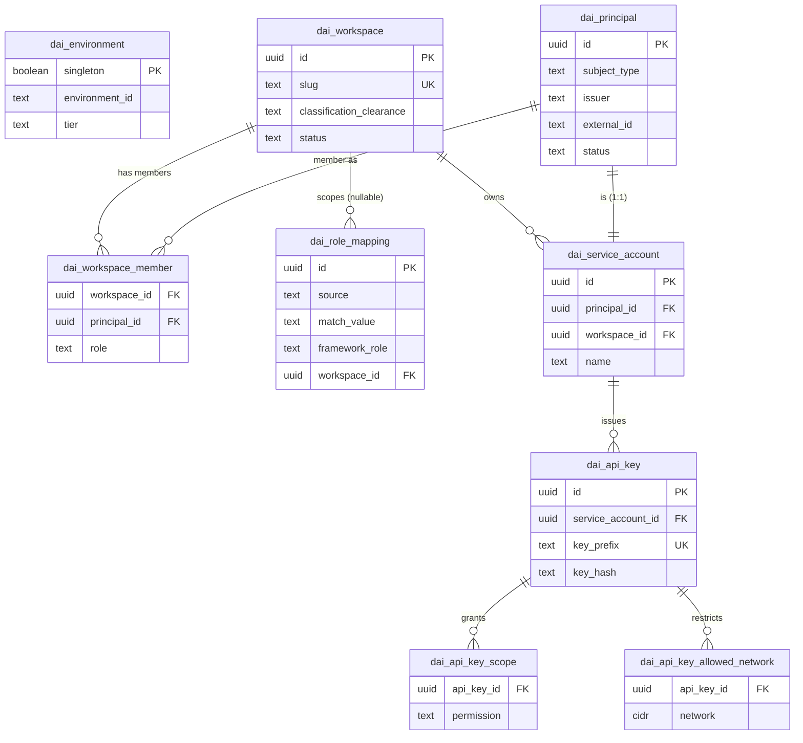
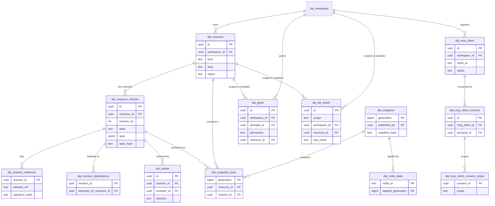
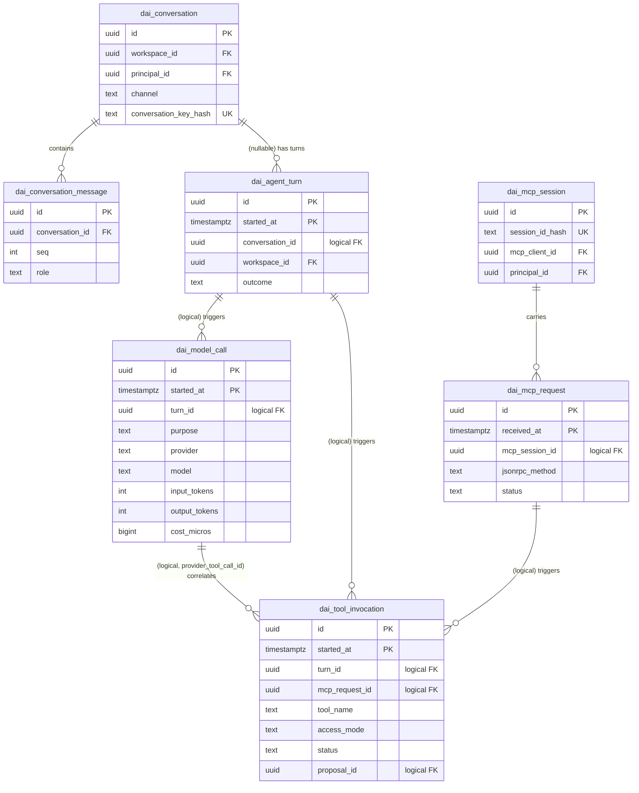
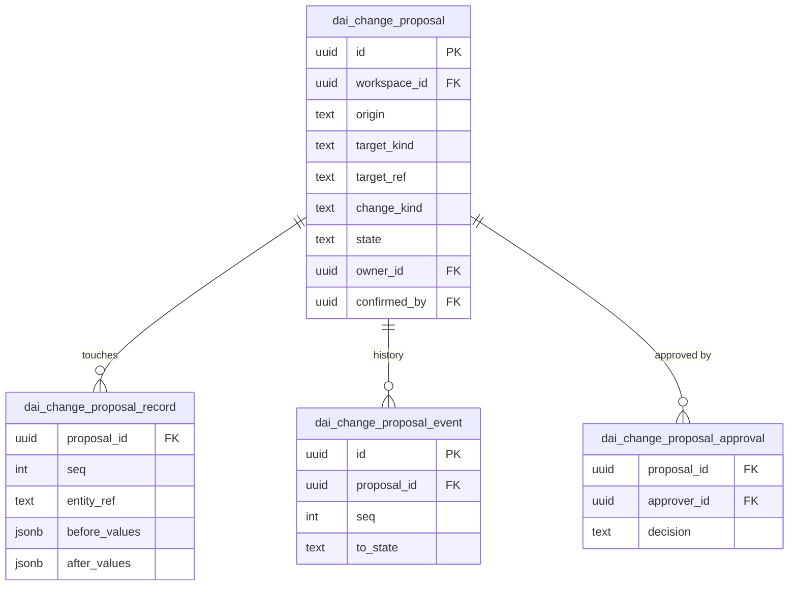
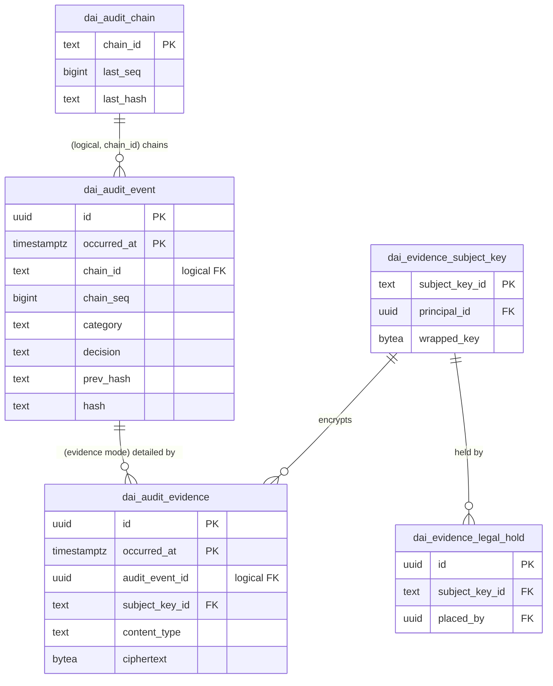
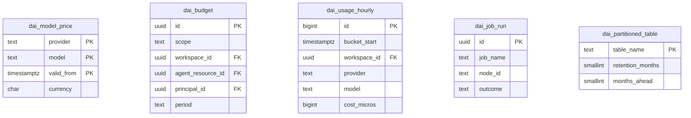

# LLD-15: Database Schema (PostgreSQL, `dynamic_ai`)

| Field | Value |
|-------|-------|
| Status | Draft v1 |
| Owner agent | technical-writer / DBA (documentation pass over the shipped migrations) |
| Module(s) | `persistence` (owns the migrations and JPA entities), `autoconfigure` (wires `DaiPersistenceUnit`) |
| Related features | F-62 … F-76 |
| Related ADRs | ADR-0006, ADR-0009, ADR-0018, ADR-0019 |
| Source of truth | `spring-ai-mcp-server-common-persistence/src/main/resources/db/dynamic-ai/migration/V1..V6__*.sql` — this document describes exactly what those files create; if the two ever disagree, the SQL wins and this doc is stale |

## 1. Purpose & responsibilities

This document is the DBA- and integrator-facing description of the `dynamic_ai` PostgreSQL schema that
backs identity references, configuration versioning, AI/MCP telemetry, reviewed write proposals, tamper-evident
audit, and cost/budget tracking for every host application that embeds springAIMcpServerCommon (ADR-0019).

It owns: schema conventions, entity-relationship overview, per-table catalog, integrity rules (triggers,
constraints, segregation of duties), partitioning and retention, a value-set reference, sizing guidance, and
backup/PITR notes. It does **not** own: the Java JPA entity mappings (persistence module), the migration SQL
itself (source of truth, see above), or the DBA operating scripts (`scripts/db/postgresql/`, LLD-adjacent but
a separate deliverable), or ORM/DAO code.

## 2. PostgreSQL version requirement

- **Minimum: PostgreSQL 15.** Three unique constraints rely on `UNIQUE NULLS NOT DISTINCT`, a PostgreSQL 15
  feature: `dai_role_mapping.uq_role_mapping`, `dai_budget.uq_budget`, `dai_usage_hourly.uq_usage_hourly`.
  Without it, two rows that are logically duplicates but differ only by a `NULL` scoping column (e.g. two
  global `dai_budget` rows with `workspace_id/agent_resource_id/principal_id` all `NULL`) would both be
  accepted, silently breaking the "one budget per scope+period" invariant.
- **Recommended: PostgreSQL 16 or 17** for production. This schema is dominated by monthly range-partitioned,
  high-write, append-mostly tables (`dai_agent_turn`, `dai_model_call`, `dai_mcp_request`,
  `dai_tool_invocation`, `dai_audit_event`, `dai_audit_evidence`); 16/17 bring materially better behaviour for
  exactly that shape of workload — faster bulk loads and `COPY` into partitioned tables, incremental sort and
  planner improvements that help the partition-pruned, `ORDER BY started_at DESC LIMIT n` queries the
  dashboards run, and continued `VACUUM`/autovacuum efficiency work that matters once retention keeps 13–14
  months of partitions live. Nothing in the schema requires 16/17; they are a performance and operability
  recommendation, not a hard dependency (OQ-29).

## 3. Schema / namespace

- Single PostgreSQL schema: **`dynamic_ai`** (Flyway sets `search_path` to it before running each migration;
  every object in the SQL is created unqualified).
- Flyway history table: **`dai_schema_history`**, also inside `dynamic_ai`.
- Every table, view, function and trigger is prefixed `dai_`/`dai_v_`/`dai_ensure_`/`dai_drop_`/`dai_forbid_`/
  `dai_touch_`/`dai_revision_`/`dai_review_`/`dai_proposal_` — collision isolation with the host's own schema
  (CLAUDE.md namespace rules). The library never creates objects outside `dynamic_ai` and never assumes it can
  read or write the host's tables.
- The schema can live in the host's own PostgreSQL database (its own schema, isolated by grants) or in a
  fully dedicated database (`dai_store` by convention) on the same or a different PostgreSQL server — both are
  supported (ADR-0019, OQ-30); see `docs/integration/host-integration-guide.md` and
  `scripts/db/postgresql/01_create_roles_and_database.sql`.

## 4. Conventions

These conventions are stated once here; per-table sections below only call out exceptions.

| Convention | Rule | Why |
|---|---|---|
| **Primary keys** | `uuid`, generated by the **application** as UUIDv7 (time-ordered, per CLAUDE.md `core Ids.newId()`); the SQL `DEFAULT gen_random_uuid()` seen on most tables is a **fallback only**, for manual/ad-hoc inserts outside the JPA path — the persistence layer always sets the id before insert | UUIDv7 keeps b-tree PK indexes append-mostly (no random-insert bloat) while staying globally unique across nodes without a central sequence; the DB-side default exists only so `psql`-driven fixes never fail on a missing id |
| **Timestamps** | `timestamptz`, always written in UTC by the application | One timezone, no ambiguity across host JVMs in different zones; `timestamptz` still displays correctly per session `TimeZone` for DBAs |
| **Closed value sets** | `text` + `CHECK (... IN (...))`, never a native `enum` type | Adding a new state is a same-transaction, no-lock `ALTER TABLE ... DROP/ADD CONSTRAINT` (or a compatible superset check) instead of `ALTER TYPE ... ADD VALUE`, which cannot run inside a transaction block and cannot be rolled back — friendlier to Flyway's transactional migrations |
| **Optimistic locking** | `row_version bigint NOT NULL DEFAULT 0` on mutable/reviewable rows: `dai_workspace`, `dai_role_mapping`, `dai_service_account`, `dai_resource`, `dai_resource_revision`, `dai_mcp_client`, `dai_conversation`, `dai_mcp_session`, `dai_budget`, `dai_change_proposal` | JPA `@Version`; append-only and immutable-after-submit tables do not need it |
| **`updated_at` maintenance** | `dai_touch_updated_at()` trigger on the same nine mutable tables (all but `dai_resource_revision`, `dai_conversation`, `dai_mcp_session`, `dai_change_proposal`, which set it as part of their own state-machine logic) | Keeps `updated_at` correct even for a manual DBA fix or a script that bypasses JPA |
| **No credentials or PII beyond subject ids** | `dai_principal` stores only `subject_type`, `issuer`, `external_id`, `display_name`, `status` — **never** a password, email address or raw token (V1 header comment); `dai_api_key` stores only `key_prefix` + `key_hash`, never the secret; `dai_evidence_subject_key.wrapped_key` is KMS-wrapped, never raw key material; `dai_mcp_session.session_id_hash` is a SHA-256 of the session id, never the id itself | Identity is owned by the host's IdP (ADR-0005); the store must stay safe to back up, replicate and query without becoming a second copy of regulated personal data |
| **Foreign keys** | Enforced between small reference/config tables (`dai_principal`, `dai_workspace`, `dai_resource`, `dai_resource_revision`); **not** enforced across high-volume partitioned tables referencing each other (§9.4) | Referential integrity where it is cheap and stable; partition-droppable independence where volume and retention need it |
| **Naming** | Tables `dai_<noun>` (singular), join/detail tables `dai_<parent>_<child>`, indexes `ix_<table>_<purpose>` / `uq_<table>_<purpose>`, constraints `pk_/fk_/ck_/uq_<table>_<purpose>`, triggers `trg_<table>_<purpose>`, functions `dai_<verb>_<noun>` | Predictable `\d+`/`pg_constraint` greps for DBAs unfamiliar with the schema |

## 5. Entity-relationship overview

Six domains, matching the six migrations. Diagrams show the tables that exist **inside** the domain; a table
already introduced in an earlier domain is referenced by name only (no attributes repeated) when it is the
target of a relationship from a later domain.

### 5.1 Identity & access (V1)

`dai_environment` is a deliberately isolated singleton (§9.5) — it has no FK to anything else in the schema.

### 5.2 Configuration & versioning (V2)

Plus a read model: `dai_v_published_resource` (view, §7.2 join of `dai_resource` × `dai_resource_revision`
filtered to `state = 'PUBLISHED'`).

### 5.3 AI / MCP telemetry (V3)

"(logical)" relationships are indexed but not FK-enforced — see §9.4.

### 5.4 Write proposals (V4)

### 5.5 Audit & evidence (V5)

### 5.6 Usage & budgets (V5/V6)

`dai_model_price` is matched to `dai_usage_hourly`/`dai_model_call` by `(provider, model, valid_from ≤ call
time)` at query/write time — not an enforced FK (a price table is a lookup table with its own lifecycle).
`dai_job_run` and `dai_partitioned_table` are maintenance bookkeeping, not linked to usage rows by FK; they are
read and written by the partition-maintenance job described in §10.

## 6. Table catalog

Grouped by domain. For each table: purpose, PK, notable columns, FKs, and indexes with the query each index
serves. Full column lists and CHECK expressions are in the migrations; §11 collects every closed value set.

### 6.1 Identity & access

| Table | Purpose | PK | Notable columns | FKs | Indexes (why) |
|---|---|---|---|---|---|
| `dai_environment` | Single-row identity of the environment that owns this store (LLD-12 §3 cross-environment guard) | `singleton` (always `true`) | `environment_id`, `tier` | — | none needed (one row) |
| `dai_principal` | Reference to an external subject (IdP user, IdP group, our service account, MCP client) — never deleted, only `DISABLED`, so historical rows stay resolvable | `id` | `subject_type`, `issuer`, `external_id`, `status` | — | `uq_principal_subject (issuer, subject_type, external_id)` — the lookup done on every authenticated request to resolve/create the principal for a token |
| `dai_workspace` | Team boundary owning resources, grants, budgets | `id` | `slug` (UK), `classification_clearance`, `tenant_id` | `created_by/updated_by → dai_principal` | `uq_workspace_slug` (routing by slug in URLs/config); `ix_workspace_tenant` partial on `tenant_id IS NOT NULL` (multi-tenant host lookups, SEC-01 §11) |
| `dai_workspace_member` | Direct membership; `principal` may itself be a `GROUP` row, so IdP group membership flows through without duplicating group rosters | `(workspace_id, principal_id, role)` | `role`, `expires_at` | `workspace_id → dai_workspace` (cascade), `principal_id`/`granted_by → dai_principal` | `ix_workspace_member_principal` — "which workspaces/roles does this principal have" on every authz decision |
| `dai_role_mapping` | IdP claim/authority/group → framework role rule (SEC-01 §3); DB rows complement static config mappings | `id` | `source`, `match_value`, `framework_role`, `workspace_id` (nullable for global roles) | `workspace_id → dai_workspace` (cascade), `created_by/updated_by → dai_principal` | `ix_role_mapping_lookup (source, match_value) WHERE enabled` — the hot path evaluated once per new token (result cached ≤ 5 min per SEC-01 §3) |
| `dai_service_account` | Workspace-owned non-human identity; wraps exactly one `dai_principal` | `id` | `name`, `status` | `principal_id → dai_principal` (1:1, `uq_service_account_principal`), `workspace_id → dai_workspace` | `uq_service_account_name (workspace_id, name)` — human-facing uniqueness inside a workspace |
| `dai_api_key` | Hashed API key credential for a service account (SEC-01 §9) | `id` | `key_prefix` (UK, public lookup part), `key_hash`, `hash_algorithm`, `expires_at`, `revoked_at` | `service_account_id → dai_service_account` (cascade) | `ix_api_key_service_account` (list keys for a service account); `ix_api_key_active_expiry (expires_at) WHERE revoked_at IS NULL` — the expiry sweep and "expiring soon" warnings scan only live keys |
| `dai_api_key_scope` | Permission subset granted to one key | `(api_key_id, permission)` | `permission` | `api_key_id → dai_api_key` (cascade) | PK is the only access path (always looked up by key) |
| `dai_api_key_allowed_network` | Optional per-key IP allow-list; no rows = any network | `(api_key_id, network)` | `network cidr` | `api_key_id → dai_api_key` (cascade) | PK is the only access path |

### 6.2 Configuration & versioning

| Table | Purpose | PK | Notable columns | FKs | Indexes (why) |
|---|---|---|---|---|---|
| `dai_resource` | Stable identity of a configurable object (endpoint, query, agent, tool binding, row policy, policy overlay, MCP server registration) | `id` | `kind`, `slug`, `status`, `suspended_reason` | `workspace_id → dai_workspace`, `created_by/updated_by → dai_principal` | `uq_resource_slug (workspace_id, kind, slug)` — human-facing uniqueness and the catalog-browser lookup; `ix_resource_kind (kind, status)` — "list all ACTIVE agents" style admin queries |
| `dai_resource_revision` | Immutable-after-submit content of a resource at one point in time (LLD-09 §2 lifecycle) | `id` | `revision_no`, `state`, `spec jsonb`, `spec_hash`, `risk_score` | `resource_id → dai_resource` (cascade), `based_on_id` (self), `author_id → dai_principal` | `uq_resource_revision_no (resource_id, revision_no)`; **`uq_resource_revision_one_published` unique partial index `WHERE state = 'PUBLISHED'`** — the DB-enforced invariant "at most one live published revision per resource"; `ix_resource_revision_pending (state, submitted_at) WHERE state IN ('IN_REVIEW','APPROVED')` — the reviewer inbox query; `ix_resource_revision_author` — "my drafts" |
| `dai_revision_reference` | Catalog elements (`entity:`/`attr:`/`op:`/`ctx:`) a revision depends on, pinned by signature hash for drift detection (LLD-03 §6) | `(revision_id, element_ref)` | `signature_hash` | `revision_id → dai_resource_revision` (cascade) | `ix_revision_reference_element` — "which revisions break if this entity/method signature changes" |
| `dai_revision_dependency` | Other resources a revision uses (endpoint → query, agent → tool binding), for impact analysis and publish ordering | `(revision_id, depends_on_resource_id)` | — | `revision_id → dai_resource_revision` (cascade), `depends_on_resource_id → dai_resource` | `ix_revision_dependency_target` — "what depends on this resource before I retire it" |
| `dai_review` | Four-eyes review decision on a revision | `id` | `decision`, `comment` | `revision_id → dai_resource_revision` (cascade), `reviewer_id → dai_principal` | `uq_review_reviewer (revision_id, reviewer_id)` — one decision per reviewer per revision |
| `dai_snapshot` | Append-only, monotonically increasing published generation with its manifest hash (ADR-0006) | `generation` (identity) | `published_by`, `manifest_hash`, `rollback_of_generation` | `published_by → dai_principal`, `rollback_of_generation` (self) | PK scan order *is* the access pattern (`SELECT max(generation)` polled by every node) |
| `dai_snapshot_entry` | One row per resource included in a generation's manifest | `(generation, resource_id)` | `revision_id` | `generation → dai_snapshot`, `resource_id → dai_resource`, `revision_id → dai_resource_revision` | `ix_snapshot_entry_revision` — "which generations published this revision" |
| `dai_node_state` | Per-cluster-node applied generation + heartbeat (F-73 convergence) | `node_id` | `applied_generation`, `heartbeat_at`, `library_version` | `applied_generation → dai_snapshot` | `ix_node_state_heartbeat` — stale-node detection |
| `dai_kill_switch` | GLOBAL / WORKSPACE / RESOURCE / TOOL emergency disable (F-73) | `id` | `scope`, `reason`, `expires_at`, `cleared_at` | `workspace_id → dai_workspace`, `resource_id → dai_resource`, `set_by/cleared_by → dai_principal` | `ix_kill_switch_active (scope, set_at) WHERE cleared_at IS NULL` — polled by every node every ~2 s (LLD-09 §4); kept tiny and indexed on purpose |
| `dai_grant` | Who may do what on which resource (SEC-01 §7) | `id` | `permission`, `resource_id` / `resource_pattern` (at most one), `conditions jsonb`, `expires_at` | `workspace_id → dai_workspace` (cascade), `principal_id → dai_principal`, `resource_id → dai_resource` (cascade), `created_by → dai_principal` | `uq_grant` unique index on the coalesced target — prevents duplicate grants; `ix_grant_principal (principal_id, permission)` — the authorization hot path (SEC-01 §7 step 3); `ix_grant_expiry` — the expiry sweep |
| `dai_mcp_client` | Approved MCP client registry per workspace (LLD-07 §5.3) | `id` | `issuer`, `client_id`, `registration_type`, `status` | `workspace_id → dai_workspace`, `approved_by/created_by → dai_principal` | `uq_mcp_client (workspace_id, issuer, client_id)`; `ix_mcp_client_lookup (issuer, client_id) WHERE status='APPROVED'` — validated on every MCP token exchange |
| `dai_mcp_client_consent` | Per-user consent to use an approved MCP client | `id` | `granted_at`, `revoked_at` | `mcp_client_id → dai_mcp_client`, `principal_id → dai_principal` | `uq_mcp_client_consent_active` unique partial index `WHERE revoked_at IS NULL` — one active consent per (client, user); `ix_mcp_client_consent_principal` — "my connected apps" UI |
| `dai_mcp_client_consent_scope` | Scopes covered by a consent | `(consent_id, scope)` | `scope` | `consent_id → dai_mcp_client_consent` (cascade) | PK is the only access path |
| `dai_v_published_resource` (view) | Convenience read model: current published revision per resource | — | joins `dai_resource` × `dai_resource_revision WHERE state='PUBLISHED'` | — | inherits base-table indexes |

### 6.3 AI / MCP telemetry (partitioned)

All six tables below are `PARTITION BY RANGE` on their leading timestamp column, each with a `DEFAULT`
partition (§10). The primary key includes the partition column because PostgreSQL requires the partition key
to be part of any unique index on a partitioned table.

| Table | Purpose | PK | Notable columns | FKs (enforced) | Indexes (why) |
|---|---|---|---|---|---|
| `dai_conversation` | Chat-memory container (LLD-06 §7); **not partitioned** — purged by `retention_until`, not partition drop | `id` | `conversation_key_hash` (UK, SHA-256 of principal+agent+client session — a guessed id alone grants nothing), `status`, `retention_until` | `workspace_id → dai_workspace`, `agent_resource_id → dai_resource`, `principal_id → dai_principal` | `ix_conversation_principal` (my conversations); `ix_conversation_agent WHERE agent_resource_id IS NOT NULL`; `ix_conversation_retention (retention_until) WHERE status <> 'ERASED'` — the purge job's scan |
| `dai_conversation_message` | One message in a conversation; **not partitioned** (bounded by its parent's retention) | `id` | `seq`, `role`, `content` (stored **after** redaction), `redacted`, `tool_call_id` | `conversation_id → dai_conversation` (cascade) | `uq_conversation_message_seq (conversation_id, seq)` — the only access path (fetch by conversation, ordered) |
| `dai_agent_turn` | One user turn → final answer | `(id, started_at)` | `outcome`, `finish_reason`, `error_code`, `time_to_first_token_ms`, `trace_id` | `workspace_id → dai_workspace`, `principal_id → dai_principal` | `ix_agent_turn_workspace/_principal/_agent` (all `... started_at DESC`) — dashboards and "my recent turns"; `ix_agent_turn_conversation`; `ix_agent_turn_trace` — jump from a trace id to the turn |
| `dai_model_call` | Every request to an LLM provider (LLD-10 §2/§5) | `(id, started_at)` | `purpose`, `provider`, `model`, tokens, `cost_micros`, `outcome`, `fallback_of_id` | `workspace_id → dai_workspace` | `ix_model_call_turn WHERE turn_id IS NOT NULL`; `ix_model_call_workspace`; `ix_model_call_model (provider, model, started_at DESC)` — per-model cost/latency dashboards; `ix_model_call_failures (started_at DESC) WHERE outcome <> 'SUCCESS'` — the error-rate alert query (LLD-10 §8) touches only failing rows |
| `dai_mcp_session` | Stateful Streamable-HTTP MCP session; **not partitioned** (bounded — one row per connection, closed sessions are small) | `id` | `session_id_hash` (UK, SHA-256 — the raw `Mcp-Session-Id` is never stored), `transport`, `end_reason` | `mcp_client_id → dai_mcp_client`, `workspace_id → dai_workspace`, `principal_id → dai_principal` | `ix_mcp_session_principal`; `ix_mcp_session_open (last_seen_at) WHERE ended_at IS NULL` — the idle-timeout sweep |
| `dai_mcp_request` | Every MCP JSON-RPC call, stateful or stateless | `(id, received_at)` | `jsonrpc_method`, `tool_name`, `status` | `mcp_client_id → dai_mcp_client`, `principal_id → dai_principal`, `workspace_id → dai_workspace` | `ix_mcp_request_session WHERE mcp_session_id IS NOT NULL`; `ix_mcp_request_principal`; `ix_mcp_request_denied (received_at DESC) WHERE status IN ('DENIED','RATE_LIMITED')` — security dashboard |
| `dai_tool_invocation` | Central "what did the AI do, on whose behalf" record — every host action or query executed or proposed via AI/MCP | `(id, started_at)` | `channel`, `tool_name`, `element_ref`, `access_mode`, `status`, `args_hash`, `result_hash`, `write_violation`, `proposal_id` | `workspace_id → dai_workspace`, `principal_id → dai_principal`, `binding_revision_id → dai_resource_revision` | `ix_tool_invocation_turn/_mcp_request` (origin lookup); `ix_tool_invocation_principal`; `ix_tool_invocation_tool (workspace_id, tool_name, started_at DESC)` — per-tool usage dashboards; `ix_tool_invocation_violation (started_at DESC) WHERE write_violation` — feeds the write-guard auto-disable counter (LLD-07 §4a); `ix_tool_invocation_proposal WHERE proposal_id IS NOT NULL` |
| `dai_v_turn_usage` (view) | Per-turn token/cost rollup, derived from `dai_model_call` (single owner of token facts) | — | `GROUP BY` turn | — | inherits base-table indexes |

### 6.4 Write proposals

| Table | Purpose | PK | Notable columns | FKs | Indexes (why) |
|---|---|---|---|---|---|
| `dai_change_proposal` | A write requested via AI/MCP/write-endpoint, pending owner confirmation (ADR-0009); **not partitioned**, purged by `retention_until` | `id` | `origin`, `target_kind`/`target_ref`, `change_kind`, `state`, `approval_requirement`, `content_hash`, `idempotency_key`, `expires_at`, `host_revision_ref` | `workspace_id → dai_workspace`, `conversation_id → dai_conversation` (`ON DELETE SET NULL`), `mcp_session_id → dai_mcp_session`, `owner_id/confirmed_by → dai_principal` | `ix_change_proposal_owner`; `ix_change_proposal_pending_expiry WHERE state IN (...)` — the expiry sweep; `ix_change_proposal_awaiting_approval` — the approver inbox; `ix_change_proposal_applying WHERE state='APPLYING'` — crash-reconciliation scan (LLD-11 §10); `uq_change_proposal_idempotency (owner_id, idempotency_key) WHERE idempotency_key IS NOT NULL` |
| `dai_change_proposal_record` | One row per record touched by a proposal (1 for single changes, many for `BULK`) | `(proposal_id, seq)` | `entity_ref`, `before_values`/`after_values jsonb` (masked, exposed attributes only), `base_version_kind/value` | `proposal_id → dai_change_proposal` (cascade) | `ix_change_proposal_record_entity (entity_ref, entity_id) WHERE entity_id IS NOT NULL` — "every proposal that touched this row" |
| `dai_change_proposal_event` | Append-only state-machine history | `id` | `from_state`, `to_state`, `actor_id`, `details jsonb` | `proposal_id → dai_change_proposal` (cascade), `actor_id → dai_principal` | `uq_change_proposal_event_seq` — ordered replay of the history |
| `dai_change_proposal_approval` | Second-person approval for sensitive proposals; approver must differ from the owner | `(proposal_id, approver_id)` | `decision`, `comment` | `proposal_id → dai_change_proposal` (cascade), `approver_id → dai_principal` | PK is the access path; segregation-of-duties trigger (§9.3) |

### 6.5 Audit & evidence

| Table | Purpose | PK | Notable columns | FKs | Indexes (why) |
|---|---|---|---|---|---|
| `dai_audit_chain` | One hash-chain head per chain (`workspace_id` as text, plus `system`/`global-admin`) — segregates chains so appends to different workspaces never contend on the same row lock | `chain_id` | `last_seq`, `last_hash` | — | PK row is `SELECT ... FOR UPDATE`-locked while appending (serializes `seq`/`hash` assignment per chain, §9.6) |
| `dai_audit_event` | Standard-tier audit record (ADR-0018 §"Standard"): who, when, what, decision, reason, ids — never prompt/row content | `(id, occurred_at)` | `category`, `action`, `plane`, `actor_id/type`, `decision`, `reason`, `environment_id`, `prev_hash`, `hash` | `actor_id/on_behalf_of_id → dai_principal`, `workspace_id → dai_workspace` | `ix_audit_event_chain (chain_id, chain_seq)` — chain verification walk; `ix_audit_event_workspace`; `ix_audit_event_actor`; `ix_audit_event_action`; `ix_audit_event_resource`; `ix_audit_event_denied (occurred_at DESC) WHERE decision='DENY'` — security review query; `ix_audit_event_proposal/_turn/_trace` — cross-linking from other planes |
| `dai_evidence_subject_key` | Per-data-subject envelope key for evidence-mode encryption (crypto-shredding unit) | `subject_key_id` | `kek_ref`, `wrapped_key bytea` (NULL ⇒ shredded) | `principal_id/shredded_by → dai_principal` | PK is the access path |
| `dai_audit_evidence` | Evidence-tier content (opt-in, ADR-0018): full prompt/completion/tool args/result, envelope-encrypted | `(id, occurred_at)` | `audit_event_id` (logical), `content_type`, `nonce`/`ciphertext bytea`, `retention_until` | `subject_key_id → dai_evidence_subject_key` | `ix_audit_evidence_event`; `ix_audit_evidence_subject` — legal-hold and crypto-shred lookups |
| `dai_evidence_legal_hold` | Active/released legal hold on a subject's evidence | `id` | `reference`, `placed_at/by`, `released_at/by` | `subject_key_id → dai_evidence_subject_key`, `placed_by/released_by → dai_principal` | `ix_evidence_legal_hold_active (subject_key_id) WHERE released_at IS NULL` — checked by the retention job before dropping an evidence partition (§10) |

### 6.6 Usage & budgets

| Table | Purpose | PK | Notable columns | FKs | Indexes (why) |
|---|---|---|---|---|---|
| `dai_model_price` | Versioned price list per provider/model (LLD-10 §5 `PriceTable`) | `(provider, model, valid_from)` | `input_per_mtok_micros`, `output_per_mtok_micros`, `cached_input_per_mtok_micros`, `currency` | `created_by → dai_principal` | PK ordering *is* the "latest price ≤ call time" query (`... WHERE valid_from <= $1 ORDER BY valid_from DESC LIMIT 1`) |
| `dai_budget` | Global/workspace/agent/principal × day/month spend limit (F-70) | `id` | `scope`, `limit_tokens`/`limit_cost_micros`, `soft_limit_pct`, `hard_limit` | `workspace_id → dai_workspace`, `agent_resource_id → dai_resource`, `principal_id → dai_principal` | `uq_budget` (one budget per exact scope+period, `NULLS NOT DISTINCT`) — the invariant this table exists to enforce |
| `dai_usage_hourly` | Hourly aggregate for budget checks and dashboards (derived, §9.1) | `id` | `bucket_start`, `calls`, tokens, `cost_micros` | `workspace_id → dai_workspace`, `agent_resource_id → dai_resource`, `principal_id → dai_principal` | `uq_usage_hourly` upsert target (`ON CONFLICT ... DO UPDATE`); `ix_usage_hourly_workspace/_principal/_agent (... bucket_start DESC)` |
| `dai_job_run` | Outcome record for maintenance jobs (partitioning, retention, purge, reconciliation) | `id` | `job_name`, `node_id`, `outcome`, `items` | — | `ix_job_run_name (job_name, started_at DESC)` — "did last night's retention run succeed" |
| `dai_partitioned_table` | Registry of partitioned tables + configured retention/lookahead, read by the maintenance job | `table_name` | `retention_months`, `months_ahead` | — | PK is the access path (small, 6 rows) |

## 7. Functions and triggers reference

| Object | Kind | Attached to | Behaviour |
|---|---|---|---|
| `dai_touch_updated_at()` | `BEFORE UPDATE` trigger function | `dai_workspace`, `dai_role_mapping`, `dai_service_account`, `dai_resource`, `dai_mcp_client`, `dai_budget` | Sets `NEW.updated_at := now()` unconditionally — correct even for writes that bypass JPA |
| `dai_forbid_modification()` | `BEFORE UPDATE OR DELETE` trigger function | `dai_snapshot`, `dai_snapshot_entry`, `dai_change_proposal_event`, `dai_audit_event`, `dai_audit_evidence` | Raises `insufficient_privilege`; makes these tables append-only at the engine level regardless of the connecting role's grants. Retention still works because it removes **whole partitions** with `DROP TABLE`, which does not fire row triggers |
| `dai_revision_immutable()` | `BEFORE UPDATE` trigger function | `dai_resource_revision` | Once `OLD.state <> 'DRAFT'`, rejects any change to `spec`, `spec_hash`, `spec_schema_version`, `author_id`, `resource_id`, `revision_no` (LLD-09 §2 "revisions immutable after submit") |
| `dai_review_segregation_of_duties()` | `BEFORE INSERT OR UPDATE` trigger function | `dai_review` | Rejects a review row whose `reviewer_id` equals the revision's `author_id` (SEC-01 §6 approver ≠ author, enforced server-side **and** at the DB) |
| `dai_proposal_approval_segregation_of_duties()` | `BEFORE INSERT OR UPDATE` trigger function | `dai_change_proposal_approval` | Rejects an approval whose `approver_id` equals the proposal's `owner_id` |
| `dai_ensure_monthly_partitions(p_parent, p_months_back, p_months_ahead)` | `SECURITY DEFINER` function, `SET search_path FROM CURRENT` | called by V6 and the maintenance job | Idempotently creates monthly `<table>_pYYYYMM` partitions for the given lookback/lookahead window; if a `DEFAULT` partition already holds rows for that month, creation of that specific month is skipped with a `WARNING` instead of aborting the rest (§10) |
| `dai_drop_monthly_partitions_before(p_parent, p_before)` | `SECURITY DEFINER` function, `SET search_path FROM CURRENT` | called by the maintenance job | Detaches and drops fully-expired monthly partitions; for `dai_audit_evidence_p%` partitions, first checks `dai_evidence_legal_hold` for any un-released hold on a subject with rows in that partition and skips the whole partition if one exists (§10) |

`SECURITY DEFINER` + `SET search_path FROM CURRENT` on the two partition-management functions is what lets the
**DML-only runtime role** (`dai_app`) run partition maintenance via `EXECUTE` privilege alone, without ever
holding `CREATE`/`DROP` rights on the schema — see `scripts/db/postgresql/02_create_schema_and_privileges.sql`.

## 8. Integrity rules beyond triggers

- **Exactly one published revision per resource**: `uq_resource_revision_one_published`, a unique index on
  `dai_resource_revision (resource_id) WHERE state = 'PUBLISHED'` — not a trigger, a partial unique index, so
  it is enforced even under concurrent publish attempts without an explicit lock.
- **Idempotent proposal confirmation**: `uq_change_proposal_idempotency (owner_id, idempotency_key) WHERE
  idempotency_key IS NOT NULL` stops a retried confirm request from creating a second proposal.
- **Only the owner may confirm their own proposal**: `ck_change_proposal_confirmer CHECK (confirmed_by IS
  NULL OR confirmed_by = owner_id)` — a plain `CHECK`, not a trigger, because it only ever compares two columns
  on the same row.
- **Principals are never hard-deleted**: no `DELETE` path is provided for `dai_principal`; the convention
  (documented in V1, not DB-enforced beyond the absence of an `ON DELETE` anywhere pointing away from it) is
  `status = 'DISABLED'`, so every historical FK (`dai_audit_event.actor_id`, `dai_resource_revision.author_id`,
  …) stays resolvable indefinitely.
- **Tamper-evident audit hash chain**: `dai_audit_event.hash = sha256(prev_hash || canonical event fields)`,
  computed by the application, not the database (canonicalisation needs stable field ordering that is easier
  to own in Java than in SQL). The chain's head is `dai_audit_chain.last_hash`, updated inside the same
  transaction as the event insert, with the chain row locked (`SELECT ... FOR UPDATE`) for the duration —
  this is what serializes `chain_seq` assignment per chain without needing a sequence object per workspace.
  A verifier walks `dai_audit_event ORDER BY chain_id, chain_seq` and recomputes each `hash` from the previous
  row's `hash` and the current row's fields; a mismatch anywhere proves tampering or a gap.
- **Crypto-shredding**: erasing a data subject's evidence is `UPDATE dai_evidence_subject_key SET wrapped_key
  = NULL, shredded_at = now(), shredded_by = ... WHERE subject_key_id = ...` — the ciphertext rows in
  `dai_audit_evidence` are left in place (they are append-only) but become permanently unreadable once the
  wrapping key is gone; the audit hash chain is untouched by this operation, so the standard-tier audit trail
  (which never held the sensitive content) stays intact and verifiable.

## 9. Normalisation notes

The schema is 3NF for the large majority of tables (`dai_workspace`, `dai_resource`/`dai_resource_revision`,
`dai_principal`, `dai_grant`, `dai_budget`, …). Five deliberate departures exist, each for a stated reason:

### 9.1 `dai_usage_hourly` is a derived, materialized aggregate

It duplicates facts that live authoritatively in `dai_model_call` (tokens, cost, counts), pre-aggregated per
`(hour, workspace, agent, principal, provider, model, currency)`. It exists so that budget checks and
dashboards never have to scan/aggregate the high-volume partitioned `dai_model_call` table on the request
path. It is written with `INSERT ... ON CONFLICT (bucket_start, workspace_id, agent_resource_id, principal_id,
provider, model, currency) DO UPDATE` by the metering writer (LLD-10 §5), asynchronously and batched. **It is
fully rebuildable** from `dai_model_call` for any hour whose source partition has not yet been dropped by
retention — treat it as a cache with a durability guarantee equal to its source's retention window, not as a
second source of truth.

### 9.2 `workspace_id` is repeated on every telemetry/audit row, not only on the owning turn

`dai_model_call`, `dai_tool_invocation`, `dai_mcp_request`, `dai_mcp_session`, `dai_agent_turn` and
`dai_audit_event` all carry their own `workspace_id`, even though for an `AGENT_TURN`-purpose model call it is
in principle derivable via `turn_id → dai_agent_turn.workspace_id`. This is intentional for two reasons:
1. **Not every row has a turn.** `dai_model_call` rows with `purpose IN ('MEMORY_SUMMARY','EVALUATION',
   'ROUTING','EMBEDDING')` have no `turn_id` at all (`ck_model_call_turn` only requires it for `AGENT_TURN`),
   and `dai_mcp_request`/`ENDPOINT`-channel `dai_tool_invocation` rows likewise have no turn. `workspace_id`
   is the *only* place that fact lives for those rows — one owner, just not always the same owner.
2. **Partition pruning.** These tables are range-partitioned by time, not by workspace. A query filtered by
   `workspace_id` needs it as a native column so the planner can combine an index on `(workspace_id,
   started_at DESC)` with partition pruning on `started_at`; deriving it via a join through `dai_agent_turn`
   (itself partitioned) on every row would defeat both.

### 9.3 JSONB payloads instead of fully normalised columns

`dai_resource_revision.spec`, `dai_grant.conditions`, `dai_change_proposal.target_args`/`validation`,
`dai_change_proposal_record.before_values`/`after_values`, and `dai_audit_event.details` are `jsonb`. Their
shape is polymorphic per resource `kind` / entity / tool and evolves independently of a schema migration
(`dai_resource_revision.spec_schema_version` versions the payload shape, not the table). Fully normalising
these would mean a Flyway migration for every new endpoint field or tool argument shape a *host developer*
introduces — a direct contradiction of the runtime-annotation-driven metadata model (ADR-0013): the framework
must accept whatever a host's `@AiContext`/`@AiExposedAction`-annotated code shape produces without a schema
change. `jsonb_typeof(...) = 'object'` checks are still enforced at the column level.

### 9.4 Logical (non-FK) references between partitioned tables

`dai_tool_invocation.turn_id`, `.model_call_id`, `.mcp_request_id`, `.proposal_id`; `dai_model_call.turn_id`;
`dai_mcp_request.mcp_session_id`/`.mcp_client_id` are all indexed but **not** `FOREIGN KEY`-constrained, as the
V3 migration header states explicitly. This is a deliberate DDIA-style trade-off: each of these tables must
remain **independently droppable by partition** for retention (§10) without a cross-table `FOREIGN KEY`
forcing a `CASCADE`/violation the moment one side's partition is gone before the other's. Correctness is kept
by populating these columns only from already-validated in-memory invocation context at insert time — never
from client-supplied identifiers — so there is no user-facing path that can insert a dangling reference. The
cost is explicit: a `dai_tool_invocation` row can outlive the `dai_agent_turn` it points to once the turn's
older partition is dropped while the tool-invocation partition (same retention, same month, so in practice
this only happens at the retention boundary) is not; application code reading a possibly-expired `turn_id`
must handle "not found" instead of relying on the database to guarantee it.

### 9.5 `dai_change_proposal_record` intentionally duplicates entity values already owned by the host

`before_values`/`after_values` (masked, exposed-attributes-only) copy a snapshot of data whose current state
is authoritatively owned by the **host's own database**, not `dynamic_ai` (ADR-0009: "data history stays owned
by the host, one owner per fact"). The duplication is deliberate: a proposal must remain reviewable and
auditable exactly as it was presented, even after the host row is later changed again or deleted. `dynamic_ai`
owns the fact "what was proposed and reviewed at proposal time"; the host continues to own "what is true now".

## 10. Partitioning, maintenance job, and retention

**Partitioned tables** (all `PARTITION BY RANGE` on a `timestamptz`, monthly boundaries, UTC): `dai_agent_turn`
(`started_at`), `dai_model_call` (`started_at`), `dai_mcp_request` (`received_at`), `dai_tool_invocation`
(`started_at`), `dai_audit_event` (`occurred_at`), `dai_audit_evidence` (`occurred_at`). Each has a `<table>
_pdefault` `DEFAULT` partition created alongside it in V3/V5, and V6 additionally creates the previous month,
current month, and 3 months ahead for all six via `dai_ensure_monthly_partitions(table, 1, 3)`.

**Not partitioned, purged by a `retention_until`/timestamp column instead**: `dai_conversation` (+ cascade to
`dai_conversation_message`) and `dai_change_proposal` (+ cascade to its `_record`/`_event`/`_approval`
children). These are lower-volume, per-entity-lifecycle tables where a plain, batched `DELETE ... WHERE
retention_until < now()` is simpler and cheap enough; partition-based retention was reserved for the
high-volume, purely time-ordered tables above.

**`dai_partitioned_table`** is the registry the maintenance job reads: `table_name`, `retention_months`,
`months_ahead`. V6 seeds it with `dai_agent_turn`/`dai_model_call`/`dai_mcp_request`/`dai_tool_invocation` at
**13 months** and `dai_audit_event`/`dai_audit_evidence` at **14 months** (≥ 400 days, matching the audit
retention default discussed in LLD-09 §7). **Ownership note**: the configured properties
`dynamic.ai.agent.store.retention.telemetry-months` and `.audit-months` (§12) are the source of truth from the
host's point of view; the application reconciles `dai_partitioned_table.retention_months` to match configured
values at startup. A DBA should not hand-edit this table without also updating the host's configuration, or
the next startup will silently overwrite the edit.

**The maintenance job** (`dynamic.ai.agent.store.maintenance.cron`, default `0 17 3 * * *` — 03:17:00 UTC daily;
scheduled by `MaintenanceRunner` on its own `dai-maintenance` thread, separate from the heartbeat thread)
runs on every node but does its work on exactly one, coordinated with `pg_try_advisory_xact_lock` keyed on a fixed
constant: a node that fails to acquire the lock records a `SKIPPED` `dai_job_run` and returns immediately.
The node holding the lock:
1. For each row in `dai_partitioned_table`, calls `dai_ensure_monthly_partitions(table_name, 1, months_ahead)`
   to keep the lookahead window populated (idempotent — a re-run the same day is a no-op).
2. For each row, calls `dai_drop_monthly_partitions_before(table_name, now() - retention_months months)`.
   For `dai_audit_evidence`, this refuses to drop a partition that still contains rows for a
   `dai_evidence_legal_hold`-protected `subject_key_id` — **the whole month's partition is kept**, not just
   the held rows (PostgreSQL drops partitions as a unit), so a single legal hold can extend that table's
   effective retention for an entire partition until the hold is released. This coarse granularity is the
   price of cheap, DROP-based retention and should be sized into legal/compliance expectations.
3. Purges expired, non-partitioned rows: `dai_conversation WHERE retention_until < now() AND status <>
   'ERASED'` and `dai_change_proposal WHERE retention_until < now()` (both `DELETE`, batched, relying on the
   `ON DELETE CASCADE` FKs to their child tables).
4. Records one `dai_job_run` row with `outcome` and `items` (partitions created/dropped, rows purged).

**`DEFAULT` partitions are a safety net only.** A row landing in `dai_agent_turn_pdefault` (etc.) means either
a clock/timezone bug, a missed maintenance run, or the job being disabled — it should be empty in a healthy
deployment. `scripts/db/postgresql/04_verify.sql` includes a query that fails loudly if any default partition
is non-empty, and this should be wired into routine monitoring, not just run ad hoc.

## 11. Value-set reference (every CHECK-constrained enumeration, copied from the SQL)

| Table.column | Allowed values |
|---|---|
| `dai_environment.tier` | `DEV`, `TEST`, `STAGE`, `PROD` |
| `dai_principal.subject_type` | `USER`, `GROUP`, `SERVICE_ACCOUNT`, `MCP_CLIENT` |
| `dai_principal.status` | `ACTIVE`, `DISABLED` |
| `dai_workspace.classification_clearance` | `PUBLIC`, `INTERNAL`, `CONFIDENTIAL`, `RESTRICTED` |
| `dai_workspace.status` | `ACTIVE`, `ARCHIVED` |
| `dai_workspace_member.role` | `WORKSPACE_OWNER`, `AUTHOR`, `APPROVER`, `OPERATOR`, `AUDITOR`, `CONSUMER` |
| `dai_role_mapping.source` | `AUTHORITY`, `OIDC_CLAIM`, `LDAP_GROUP`, `SCOPE` |
| `dai_role_mapping.framework_role` | `PLATFORM_ADMIN`, `SECURITY_ADMIN`, `AUDITOR`, `WORKSPACE_OWNER`, `AUTHOR`, `APPROVER`, `OPERATOR`, `CONSUMER` |
| `dai_service_account.status` | `ACTIVE`, `DISABLED` |
| `dai_api_key.hash_algorithm` | `hmac-sha256`, `argon2id`, `bcrypt`, `pbkdf2-sha256` |
| `dai_resource.kind` | `ENDPOINT`, `QUERY`, `AGENT`, `TOOL_BINDING`, `ROW_POLICY`, `POLICY_OVERLAY`, `MCP_SERVER` |
| `dai_resource.status` | `ACTIVE`, `SUSPENDED`, `RETIRED` |
| `dai_resource_revision.state` | `DRAFT`, `IN_REVIEW`, `APPROVED`, `PUBLISHED`, `SUPERSEDED`, `REJECTED`, `STALE`, `DEPRECATED`, `RETIRED` |
| `dai_revision_reference.element_ref` (prefix) | `entity:`, `attr:`, `op:`, `ctx:` |
| `dai_review.decision` | `APPROVED`, `REJECTED`, `CHANGES_REQUESTED` |
| `dai_kill_switch.scope` | `GLOBAL`, `WORKSPACE`, `RESOURCE`, `TOOL` |
| `dai_mcp_client.registration_type` | `PRE_REGISTERED`, `CIMD`, `DCR` |
| `dai_mcp_client.status` | `PENDING`, `APPROVED`, `REVOKED` |
| `dai_mcp_client_consent_scope.scope` | `dai.mcp.read`, `dai.mcp.propose`, `dai.mcp.agents` |
| `dai_conversation.channel` | `CHAT`, `PLAYGROUND`, `MCP`, `ENDPOINT` |
| `dai_conversation.status` | `ACTIVE`, `CLOSED`, `ERASED` |
| `dai_conversation_message.role` | `USER`, `ASSISTANT`, `TOOL`, `SYSTEM` |
| `dai_agent_turn.channel` | `CHAT`, `PLAYGROUND`, `MCP`, `ENDPOINT` |
| `dai_agent_turn.finish_reason` | `STOP`, `LENGTH`, `TOOL_LIMIT`, `BUDGET`, `CANCELLED`, `ERROR` |
| `dai_agent_turn.outcome` | `SUCCESS`, `FAILED`, `CANCELLED`, `REJECTED` |
| `dai_model_call.purpose` | `AGENT_TURN`, `MEMORY_SUMMARY`, `EVALUATION`, `ROUTING`, `EMBEDDING` |
| `dai_model_call.outcome` | `SUCCESS`, `ERROR`, `TIMEOUT`, `CANCELLED`, `CIRCUIT_OPEN`, `RATE_LIMITED` |
| `dai_mcp_session.transport` | `STREAMABLE_HTTP`, `STATELESS`, `SSE` |
| `dai_mcp_session.end_reason` | `CLIENT_CLOSED`, `IDLE_TIMEOUT`, `TOKEN_EXPIRED`, `REVOKED`, `SERVER_SHUTDOWN`, `ERROR` |
| `dai_mcp_request.status` | `OK`, `ERROR`, `DENIED`, `RATE_LIMITED` |
| `dai_tool_invocation.channel` | `CHAT`, `PLAYGROUND`, `MCP`, `ENDPOINT` |
| `dai_tool_invocation.element_ref` (prefix) | `op:`, `entity:`, `query:`, `agent:`, `mcp:` |
| `dai_tool_invocation.access_mode` | `READ`, `PROPOSE` |
| `dai_tool_invocation.status` | `OK`, `EMPTY`, `TRUNCATED`, `ERROR`, `NOT_PERMITTED`, `UNAVAILABLE`, `PROPOSED`, `TIMEOUT` |
| `dai_change_proposal.origin` | `AGENT_TOOL`, `MCP_TOOL`, `WRITE_ENDPOINT` |
| `dai_change_proposal.channel` | `CHAT`, `PLAYGROUND`, `MCP`, `ENDPOINT` |
| `dai_change_proposal.target_kind` | `HOST_OPERATION` (`target_ref` must be `op:%`), `ENTITY_WRITE` (`target_ref` must be `entity:%`) |
| `dai_change_proposal.change_kind` | `CREATE`, `UPDATE`, `DELETE`, `BULK` |
| `dai_change_proposal.state` | `PROPOSED`, `EDITED`, `AWAITING_APPROVAL`, `CONFIRMED`, `APPLYING`, `APPLIED`, `REJECTED`, `EXPIRED`, `CONFLICT`, `FAILED` |
| `dai_change_proposal.approval_requirement` | `SELF_CONFIRM` (`required_approvals = 0`), `SELF_CONFIRM_PLUS_APPROVER` (`required_approvals` 1–5) |
| `dai_change_proposal_record.entity_ref` (prefix) | `entity:` |
| `dai_change_proposal_record.base_version_kind` | `JPA_VERSION`, `ENVERS_REVISION`, `HISTORY_TABLE`, `TEMPORAL`, `ROW_HASH`, `CUSTOM` |
| `dai_change_proposal_event.to_state` | same 10 values as `dai_change_proposal.state` |
| `dai_change_proposal_approval.decision` | `APPROVED`, `REJECTED` |
| `dai_audit_event.category` | `ADMIN`, `SECURITY`, `INVOCATION`, `DATA_WRITE`, `SYSTEM` |
| `dai_audit_event.plane` | `CONTROL`, `DATA`, `AGENT`, `MCP`, `SYSTEM` |
| `dai_audit_event.actor_type` | `USER`, `GROUP`, `SERVICE_ACCOUNT`, `MCP_CLIENT`, `SYSTEM` (`SYSTEM` ⇒ `actor_id IS NULL`) |
| `dai_audit_event.decision` | `PERMIT`, `DENY`, `NOT_APPLICABLE` |
| `dai_audit_evidence.content_type` | `PROMPT`, `COMPLETION`, `TOOL_ARGUMENTS`, `TOOL_RESULT`, `PROPOSAL_PAYLOAD` |
| `dai_budget.scope` | `GLOBAL`, `WORKSPACE`, `AGENT`, `PRINCIPAL` |
| `dai_budget.period` | `DAY`, `MONTH` |
| `dai_job_run.outcome` | `SUCCESS`, `PARTIAL`, `FAILED`, `SKIPPED` |

### 11.1 Pattern-constrained columns (also `CHECK`, not a discrete value set)

| Column | Pattern | Meaning |
|---|---|---|
| `dai_environment.environment_id` | `^[A-Za-z0-9][A-Za-z0-9._-]{0,127}$` | Matches `${spring.application.name}-<tier>` default |
| `dai_workspace.slug`, `dai_service_account.name` | `^[a-z][a-z0-9-]{1,62}$` | URL/slug-safe |
| `dai_resource.slug` | `^[a-z][a-z0-9_-]{1,62}$` | Same, underscore also allowed |
| `dai_api_key.key_prefix` | `^dai_[a-z]+_[A-Za-z0-9]{8,32}$` | `dai_<env>_<keyId>` public part |
| `dai_api_key_scope.permission`, `dai_grant.permission` | `^[a-z][a-z-]*:[a-z][a-z-]*$` | `resource:action` permission strings |
| `dai_kill_switch.tool_name`, `dai_mcp_request.tool_name`, `dai_tool_invocation.tool_name` | `^[a-z][a-z0-9_]{2,63}$` | MCP/tool-callback naming rule (LLD-07 §5.2) |
| `*.spec_hash`, `*.manifest_hash`, `*.content_hash`, `*.args_hash`, `*.result_hash`, `dai_audit_chain.last_hash`, `dai_audit_event.prev_hash`/`hash` | `^sha256:[0-9a-f]{64}$` | Hex-encoded SHA-256, always prefixed |
| `dai_mcp_request.jsonrpc_method` | `^[a-z][A-Za-z/_]{1,63}$` | JSON-RPC method name |
| `dai_audit_event.action` | `^[A-Z][A-Z0-9_]{2,63}$` | Audit event catalog constant (LLD-10 §4) |
| `dai_audit_chain.chain_id` | `^[a-z0-9-]{3,64}$` | Workspace UUID text, or `system`/`global-admin` |
| `dai_job_run.job_name` | `^[a-z][a-z0-9-]{2,63}$` | e.g. `partition-maintenance`, `retention-purge` |
| `dai_model_call.currency`, `dai_model_price.currency`, `dai_budget.currency`, `dai_usage_hourly.currency` | `^[A-Z]{3}$` | ISO 4217 |

## 12. Configuration (`dynamic.ai.agent.*`)

This is the property contract the schema and the DBA scripts are built against. All defaults below are the
current, implemented contract for version **0.1.0-SNAPSHOT**.

| Property | Default | Description |
|---|---|---|
| `dynamic.ai.agent.enabled` | `true` | Master switch for the whole starter |
| `dynamic.ai.agent.environment.tier` | unset | `DEV`\|`TEST`\|`STAGE`\|`PROD`; unset ⇒ `UNKNOWN`, treated as `PROD` (LLD-12 §2.1). Written into `dai_environment.tier` on first migration/start |
| `dynamic.ai.agent.environment.id` | `${spring.application.name}-<tier>` | Written into `dai_environment.environment_id`; checked on every subsequent start (LLD-12 §3 cross-environment guard) |
| `dynamic.ai.agent.store.enabled` | `true` | Enables the persistence unit at all |
| `dynamic.ai.agent.store.schema` | `dynamic_ai` | Schema name; changing it is a deliberate DBA action, not expected in normal operation |
| `dynamic.ai.agent.store.migrate` | `true` | Run Flyway migrations at startup; `false` ⇒ a DBA runs them out-of-band with the Flyway CLI (`scripts/db/postgresql/README.md`) |
| `dynamic.ai.agent.store.validate-schema` | `false` | When `true`, validates the applied schema against the expected migration state without applying pending migrations (useful with `migrate=false`) |
| `dynamic.ai.agent.store.datasource.url` | unset | Set ⇒ dedicated PostgreSQL datasource for the store; unset ⇒ reuses the host's unique `DataSource` (still schema `dynamic_ai`) — ADR-0019, OQ-30 |
| `dynamic.ai.agent.store.datasource.username` / `.password` | unset | Runtime (`dai_app`) credentials for the dedicated datasource |
| `dynamic.ai.agent.store.datasource.maximum-pool-size` | `10` | Pool size for the dedicated datasource |
| `dynamic.ai.agent.store.datasource.connection-timeout` | `5s` | |
| `dynamic.ai.agent.store.migration.username` / `.password` | unset | Optional separate DDL/owner credentials (`dai_migrator`) used only by Flyway; falls back to the runtime datasource credentials if unset |
| `dynamic.ai.agent.store.retention.telemetry-months` | `13` | Reconciled into `dai_partitioned_table.retention_months` for `dai_agent_turn`/`dai_model_call`/`dai_mcp_request`/`dai_tool_invocation` |
| `dynamic.ai.agent.store.retention.audit-months` | `14` | Reconciled into `dai_partitioned_table.retention_months` for `dai_audit_event`/`dai_audit_evidence` |
| `dynamic.ai.agent.store.retention.conversation-days` | `30` | Drives `dai_conversation.retention_until` at creation/update time |
| `dynamic.ai.agent.store.retention.proposal-days` | `7` | Drives `dai_change_proposal.retention_until` at creation time |
| `dynamic.ai.agent.store.maintenance.enabled` | `true` | Runs the maintenance runner on this node; `false` leaves partitioning, retention, heartbeat and sweeps to the operator (OQ-31) |
| `dynamic.ai.agent.store.maintenance.cron` | `0 17 3 * * *` | Partition creation, retention drop, and non-partitioned purge (§10); Spring six-field cron evaluated in UTC |
| `dynamic.ai.agent.store.maintenance.{snapshot-poll-interval,heartbeat-interval,sweep-interval}` | `5s` / `15s` / `5m` | Generation poll, `dai_node_state` heartbeat, and the sweeps (silent nodes after `node-retention` 24h, approvals after `approval-ttl` 30d, proposals stuck in APPLYING after `apply-timeout` 10m) |
| `dynamic.ai.agent.store.maintenance.node-id` | host name + random suffix | Id of this node in `dai_node_state` and `dai_job_run` |
| `dynamic.ai.agent.audit.evidence.enabled` | `false` | Opt-in evidence tier (ADR-0018); gates whether `dai_audit_evidence`/`dai_evidence_subject_key` ever receive writes |
| `dynamic.ai.agent.security.api-key.pepper-secret-ref` | unset | Reference (via `SecretResolver`) to the HMAC pepper used for `dai_api_key.key_hash` when `hash_algorithm = hmac-sha256` |

Related feature switches (LLD-01 §4, all default `false`) do not change the schema itself but gate whether
certain tables ever see traffic: `endpoints.enabled`, `agents.enabled`, `admin.enabled`, `admin.ui.enabled`,
`mcp.server.enabled` — e.g. with `mcp.server.enabled=false`, `dai_mcp_session`/`dai_mcp_request` stay empty.

## 13. Sizing guidance

**These are estimation assumptions, not measurements** — no load test has produced them. State the assumptions
whenever you use this table so a reviewer can re-derive the numbers for a different usage profile.

Assumptions per 1,000 daily active users of a host application: 5 agent turns/user/day; ~2 model calls per
turn on average (one main call plus tool-loop continuations); ~3 tool invocations per turn on average; ~6
conversation messages per turn (user + assistant + tool messages); 10% of users also use an MCP client, at
~5 MCP requests/day each; roughly one audit event per tool invocation plus one per turn plus a smaller stream
of admin/security events; ~5% of tool invocations are proposal-creating writes.

| Table | Driver | Rows/day per 1,000 DAU (estimate) | Note |
|---|---|---|---|
| `dai_agent_turn` | 1 row/turn | ~5,000 | |
| `dai_model_call` | ~2 calls/turn | ~10,000 | Grows with agentic tool-loop depth and any retry/fallback calls |
| `dai_tool_invocation` | ~3 calls/turn | ~15,000 | Largest steady write driver besides messages |
| `dai_conversation_message` | ~6 messages/turn | ~30,000 | **Not partitioned** — bounded by `retention_until` (30 days default), so its steady-state size is ~30 days × this rate, not 13 months |
| `dai_mcp_request` | 10% of users × 5/day | ~500 | Stateless-mode clients also re-poll `tools/list`, which adds to this |
| `dai_mcp_session` | ~1 new session/MCP user/day | ~100 | |
| `dai_audit_event` | ~1/tool invocation + ~1/turn + admin/security | ~20,000–25,000 | Longest retention (14 months) of any high-volume table — dominates total storage over time |
| `dai_change_proposal` | ~5% of tool invocations | ~750 | **Not partitioned** — bounded by `retention_until` (7 days default) |
| `dai_usage_hourly` | distinct `(hour, workspace, agent, principal, provider, model, currency)` combinations, not per-event | tens to low hundreds/hour | Derived (§9.1); size is bounded by cardinality of dimensions, not by traffic volume |

**Index/partition sizing implication**: at ~15,000–25,000 rows/day into the 13–14-month-retained partitioned
tables, one monthly partition of `dai_tool_invocation` holds on the order of 450,000–750,000 rows per 1,000
DAU (30 days × 15k–25k/day), and the full retention window (13–14 partitions) on the order of 6–10.5 million
rows per 1,000 DAU per table. This is comfortably within normal PostgreSQL partition sizing (each partition
plus its indexes should stay in the low-single-digit-GB range per 1,000 DAU at these rates); partition pruning
on `started_at`/`occurred_at`/`received_at` keeps almost every dashboard and lookup query — all of which filter
by a recent time range per the index list in §6.3/§6.5 — scanning one or two partitions, not the whole table.
Re-check `months_ahead` (default 3) against actual DAU growth curves: if the deploying team expects DAU to
grow fast enough that a quarter's lookahead is too short notice for capacity planning, increase
`months_ahead` in `dai_partitioned_table` (via the maintenance job's next run, not by hand) rather than
shortening the cron interval.

## 14. Backup, restore, and point-in-time recovery (PITR)

- **Use continuous archiving (WAL + base backups), not `pg_dump` alone, for anything beyond a dev/test
  snapshot.** `pg_dump`/`pg_restore` are appropriate for schema-only backups (e.g. capturing the DDL before a
  DBA-run migration) and for moving data between environments during onboarding, but they do not give a
  transactionally consistent point-in-time recovery target across the whole store, and every table here that
  matters for audit/versioning integrity (`dai_snapshot`, `dai_audit_event`, `dai_resource_revision`) needs
  that consistency.
- **Roles and grants are part of the backup.** `dai_owner`, `dai_migrator`, `dai_app` and their grants are
  created by `scripts/db/postgresql/01_create_roles_and_database.sql` /
  `02_create_schema_and_privileges.sql`, which live outside `pg_dump`'s normal schema-and-data dump (role
  definitions are cluster-global, not per-database, unless `pg_dumpall --globals-only` is used). After any
  restore, re-run `02_create_schema_and_privileges.sql`, `03_post_migration_grants.sql` and `04_verify.sql` to
  confirm the runtime role (`dai_app`) can actually connect and operate — a data-only restore into a database
  where these roles don't yet exist will leave the application unable to start.
- **The audit hash chain survives an ordinary PITR restore intact.** Because `prev_hash`/`hash` are computed
  and stored as ordinary transactional columns, restoring to any consistent point in time keeps every chain
  internally consistent (each row's `prev_hash` still matches the previous row's `hash` in `chain_seq` order).
  Always re-verify the chain after a restore (a walk of `dai_audit_event ORDER BY chain_id, chain_seq`,
  recomputing hashes) as part of the restore drill — it is the cheapest possible proof that the restore
  captured a clean, non-corrupted point.
- **Dedicated database (option A) vs. shared host database (option B) changes what "consistent" means.** If
  `dynamic_ai` lives in its own database (`dai_store`), it can — and for PROD, should — be backed up and
  restored on its own schedule, independent of the host's OLTP database; this is one of the main operational
  reasons ADR-0019/OQ-30 recommend a dedicated database for PROD (the audit/telemetry write volume otherwise
  forces the host's backup cadence to match this store's, or vice versa). The cost is that the two databases
  can be restored to *different* points in time, and nothing in this schema detects that a stage/prod
  `dynamic_ai` store has been paired with the wrong host database — only `dai_environment` (LLD-12 §3)
  detects a mismatched **environment identity**, not a time-skew between two independently restored stores.
  If `dynamic_ai` shares the host's database (option B), a single restore keeps both consistent by
  construction, at the cost of coupling their backup/restore cadence and retention.
- **Restore the whole schema as a unit, never a subset of tables.** Foreign keys tie `dai_audit_event`,
  `dai_change_proposal`, `dai_grant`, etc. back to `dai_principal`/`dai_workspace`/`dai_resource`; restoring
  only, say, `dai_audit_event` from an older backup into a database with newer reference tables risks either
  FK violations on restore or (if constraints are temporarily disabled) orphaned rows.
- **Restore drill checklist**: after restoring — (1) run `04_verify.sql` (schema history, partitions-ahead,
  empty default partitions, `dai_environment` row, audit chain heads, `dai_app` grants); (2) confirm
  `dai_environment.environment_id`/`tier` match the target deployment, not the source of the backup (a
  PROD backup restored into STAGE must be caught here before the app is allowed to serve traffic, LLD-12 §3);
  (3) confirm `dai_schema_history`'s latest applied migration matches the version the application build
  expects before starting the app pointed at the restored store.

## 15. Test strategy

- Migration tests: apply V1..V6 against a fresh PostgreSQL 15, 16 and 17 Testcontainers instance; assert final
  `information_schema`/`pg_constraint` state matches this document's table/index/constraint catalog (§6, §11).
- Constraint tests: one test per CHECK in §11 proving both the boundary-valid and boundary-invalid value.
- Trigger tests: append-only violation on each table in §7; revision immutability after leaving `DRAFT`;
  both segregation-of-duties triggers; `dai_touch_updated_at` on a raw JDBC update bypassing JPA.
- Partition tests: `dai_ensure_monthly_partitions` idempotency (second call creates zero partitions);
  `dai_drop_monthly_partitions_before` respecting an active `dai_evidence_legal_hold`; a simulated
  default-partition collision producing the documented `WARNING` instead of aborting the whole run.
- Upgrade tests: apply V1..V6 against a database already seeded with representative rows from the previous
  minor version's migration set (once a second release exists) to catch a migration that is not purely
  additive.

## 16. Open questions

OQ-29 (minimum PostgreSQL version — resolved to 15 in this doc, recommendation only for 16/17), OQ-30
(dedicated database vs. host database — both documented here and in the integration guide, still a
per-deployment decision), OQ-31 (retention defaults and who runs partition maintenance — documented in §10/§12
as "built-in job, advisory-locked, any node"; still open whether a deploying team may disable the built-in job
entirely and run 100% DBA-driven maintenance — resolved: `store.maintenance.enabled=false` turns the runner off;
the DBA then owns partitions, retention and the sweeps).
